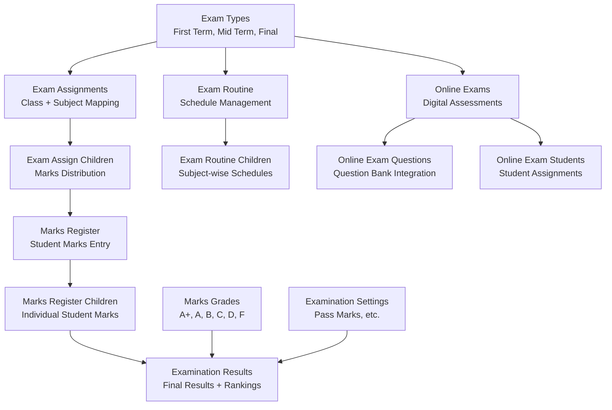
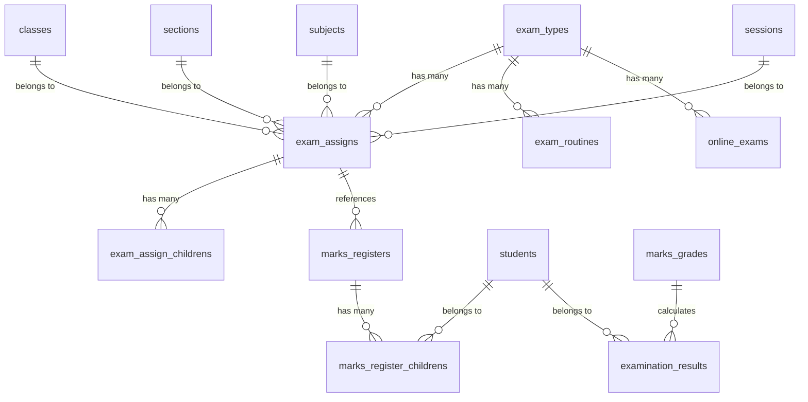
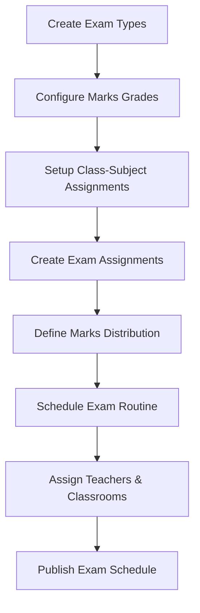
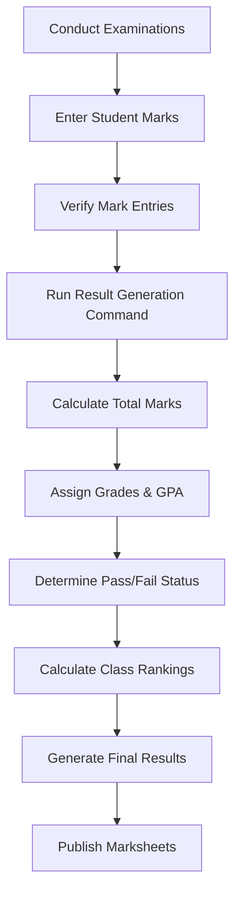
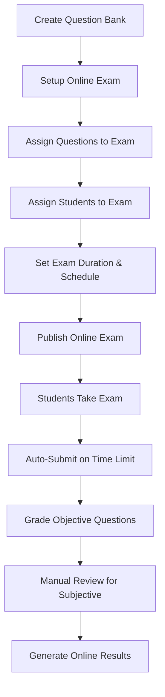

# Examination Module Architecture Analysis
**Laravel School Management System - Comprehensive Technical Documentation**

---

## Table of Contents

1. [Executive Summary](#1-executive-summary)
2. [System Architecture Overview](#2-system-architecture-overview)
3. [Core Components Breakdown](#3-core-components-breakdown)
4. [Database Architecture](#4-database-architecture)
5. [Business Workflows](#5-business-workflows)
6. [Advanced Features](#6-advanced-features)
7. [Integration Points](#7-integration-points)
8. [API & Access Control](#8-api--access-control)
9. [Practical Use Cases](#9-practical-use-cases)
10. [Implementation Examples](#10-implementation-examples)

---

## 1. Executive Summary

### System Overview

The Examination Module is a comprehensive assessment management system within the Laravel-based School Management System that handles both **traditional offline examinations** and **online examinations**. The module supports complete exam lifecycle management from setup to result generation with automated grading and reporting.

### Key Capabilities

- **Dual Examination Types**: Supports both offline and online examinations
- **Flexible Exam Configuration**: Multiple exam types (First Term, Mid Term, Final) with customizable marks distribution
- **Automated Result Processing**: Console command for bulk result generation with rankings
- **Grade Management**: Configurable grading system with percentage-based grade assignment
- **Multi-Platform Access**: Web interface, student/parent portals, and API endpoints
- **Permission-Based Access**: Role-based access control with granular permissions

### Architecture Benefits

- **Modular Design**: Separate controllers and repositories for different examination aspects
- **Multi-tenant Support**: Full SaaS compatibility with branch isolation
- **Scalable Structure**: Repository pattern with interface-based implementation
- **Automated Processing**: Background jobs for result calculation and ranking

---

## 2. System Architecture Overview

### Examination Hierarchy



### Module Structure

```
app/
├── Models/
│   ├── Examination/
│   │   ├── ExamType.php                 # Exam categories (Term, Mid-term, Final)
│   │   ├── ExamAssign.php              # Class-Subject-Exam assignments
│   │   ├── ExamAssignChildren.php      # Marks distribution details
│   │   ├── ExaminationSettings.php     # System configuration
│   │   ├── MarksGrade.php              # Grading scale (A+, A, B, etc.)
│   │   ├── MarksRegister.php           # Subject-wise mark records
│   │   └── MarksRegisterChildren.php   # Individual student marks
│   ├── Academic/
│   │   ├── ExamRoutine.php             # Exam scheduling
│   │   └── ExamRoutineChildren.php     # Subject-wise schedules
│   ├── OnlineExamination/
│   │   ├── OnlineExam.php              # Digital exam management
│   │   ├── QuestionBank.php            # Question repository
│   │   └── Answer.php                  # Student responses
│   └── ExaminationResult.php           # Final consolidated results
├── Http/Controllers/
│   ├── Examination/                     # Core examination controllers
│   ├── Academic/ExamRoutineController   # Schedule management
│   └── OnlineExamination/              # Online exam controllers
├── Repositories/                        # Business logic layer
├── Console/Commands/
│   └── ExamResultGenerate.php          # Automated result processing
└── Http/Requests/                       # Validation rules
```

---

## 3. Core Components Breakdown

### 3.1 Exam Types (`ExamType`)

**Purpose**: Defines examination categories and periods

**Key Features**:
- Predefined types: First Term, Mid Term, Final Exam
- Extensible for custom exam types
- Links to both offline and online examinations
- Active/Inactive status management

**Relationships**:
```php
// HasMany relationships
- examAssigns()      // Links to exam assignments
- examRoutines()     // Links to exam schedules  
- onlineExams()      // Links to online examinations
- markRegisters()    // Links to marks records
```

### 3.2 Exam Assignment System

#### ExamAssign Model
**Purpose**: Maps examinations to specific class-subject combinations

**Key Fields**:
- `session_id`: Academic session
- `classes_id`: Target class/grade
- `section_id`: Class section
- `exam_type_id`: Type of examination
- `subject_id`: Subject being examined
- `total_mark`: Maximum possible marks

#### ExamAssignChildren Model
**Purpose**: Defines detailed marks distribution for each exam assignment

**Features**:
- Breakdown of marks (Written, MCQ, Practical, etc.)
- Flexible marks allocation per component
- Support for multiple assessment types per subject

### 3.3 Marks Management System

#### MarksRegister Model
**Purpose**: Central repository for subject-wise examination marks

**Key Features**:
- Session and class-wise organization
- Subject-specific mark records
- Marksheet publication control
- Integration with grading system

#### MarksRegisterChildren Model
**Purpose**: Individual student marks for specific subjects

**Key Fields**:
- `student_id`: Student identifier
- `mark`: Obtained marks
- `attendance`: Present/Absent status
- Links to parent MarksRegister

### 3.4 Grading System (`MarksGrade`)

**Purpose**: Configurable grading scale with percentage ranges

**Default Grade Structure**:
```php
A+: 80-100% (5.00 points)
A:  70-79%  (4.50 points)  
A-: 60-69%  (4.00 points)
B:  50-59%  (3.00 points)
C:  40-49%  (2.00 points)
D:  33-39%  (1.00 points)
F:  0-32%   (0.00 points)
```

### 3.5 Exam Routine Management

#### ExamRoutine Model
**Purpose**: Manages examination schedules and logistics

**Key Features**:
- Date and time scheduling
- Classroom assignment
- Teacher assignment (invigilator)
- Subject-wise schedule management
- Time slot integration

#### ExamRoutineChildren Model
**Purpose**: Detailed subject-wise examination schedules

**Relationships**:
- Links to subjects, teachers, classrooms
- Time schedule integration
- Exam type association

---

## 4. Database Architecture

### Core Tables Structure

#### 1. `exam_types`
```sql
CREATE TABLE `exam_types` (
  `id` bigint UNSIGNED NOT NULL,
  `name` varchar(255) NOT NULL,           -- 'First Term Exam', 'Mid Term Exam'
  `status` tinyint DEFAULT '1',           -- Active/Inactive
  `created_at` timestamp NULL,
  `updated_at` timestamp NULL,
  `branch_id` bigint UNSIGNED DEFAULT '1' -- Multi-tenant support
);
```

#### 2. `exam_assigns`
```sql
CREATE TABLE `exam_assigns` (
  `id` bigint UNSIGNED NOT NULL,
  `session_id` bigint UNSIGNED NOT NULL,  -- Academic session
  `classes_id` bigint UNSIGNED NOT NULL,  -- Class/Grade
  `section_id` bigint UNSIGNED NOT NULL,  -- Section
  `exam_type_id` bigint UNSIGNED NOT NULL,-- Exam type
  `subject_id` bigint UNSIGNED NOT NULL,  -- Subject
  `total_mark` double DEFAULT NULL,       -- Maximum marks
  `created_at` timestamp NULL,
  `updated_at` timestamp NULL,
  `branch_id` bigint UNSIGNED DEFAULT '1'
);
```

#### 3. `exam_assign_childrens`
```sql
CREATE TABLE `exam_assign_childrens` (
  `id` bigint UNSIGNED NOT NULL,
  `exam_assign_id` bigint UNSIGNED NOT NULL, -- Parent assignment
  `title` varchar(255) DEFAULT NULL,         -- 'Written', 'MCQ', 'Practical'
  `mark` double DEFAULT NULL,                -- Marks for this component
  `created_at` timestamp NULL,
  `updated_at` timestamp NULL,
  `branch_id` bigint UNSIGNED DEFAULT '1'
);
```

#### 4. `marks_registers`
```sql
CREATE TABLE `marks_registers` (
  `id` bigint UNSIGNED NOT NULL,
  `session_id` bigint UNSIGNED NOT NULL,
  `classes_id` bigint UNSIGNED NOT NULL,
  `section_id` bigint UNSIGNED NOT NULL,
  `exam_type_id` bigint UNSIGNED NOT NULL,
  `subject_id` bigint UNSIGNED NOT NULL,
  `marksheet_published` tinyint DEFAULT '0', -- Publication status
  `created_at` timestamp NULL,
  `updated_at` timestamp NULL,
  `branch_id` bigint UNSIGNED DEFAULT '1'
);
```

#### 5. `marks_register_childrens`
```sql
CREATE TABLE `marks_register_childrens` (
  `id` bigint UNSIGNED NOT NULL,
  `marks_register_id` bigint UNSIGNED NOT NULL, -- Parent register
  `student_id` bigint UNSIGNED NOT NULL,        -- Student
  `mark` double DEFAULT NULL,                   -- Obtained marks
  `attendance` varchar(255) DEFAULT 'Present', -- Attendance status
  `created_at` timestamp NULL,
  `updated_at` timestamp NULL,
  `branch_id` bigint UNSIGNED DEFAULT '1'
);
```

#### 6. `examination_results`
```sql
CREATE TABLE `examination_results` (
  `id` bigint UNSIGNED NOT NULL,
  `session_id` bigint UNSIGNED DEFAULT NULL,
  `exam_type_id` bigint UNSIGNED DEFAULT NULL,
  `classes_id` bigint UNSIGNED DEFAULT NULL,
  `section_id` bigint UNSIGNED DEFAULT NULL,
  `student_id` bigint UNSIGNED DEFAULT NULL,
  `result` varchar(255) DEFAULT NULL,           -- 'Passed'/'Failed'
  `grade_name` varchar(255) DEFAULT NULL,       -- 'A+', 'A', 'B', etc.
  `grade_point` varchar(255) DEFAULT NULL,      -- GPA points
  `position` int DEFAULT NULL,                  -- Class ranking
  `total_marks` int DEFAULT NULL,               -- Sum of all subjects
  `created_at` timestamp NULL,
  `updated_at` timestamp NULL,
  `branch_id` bigint UNSIGNED DEFAULT '1'
);
```

#### 7. `marks_grades`
```sql
CREATE TABLE `marks_grades` (
  `id` bigint UNSIGNED NOT NULL,
  `name` varchar(255) NOT NULL,             -- 'A+', 'A', 'B'
  `point` varchar(255) NOT NULL,            -- '5.00', '4.50'
  `percent_from` varchar(255) NOT NULL,     -- '80'
  `percent_upto` varchar(255) NOT NULL,     -- '100'
  `remarks` varchar(255) DEFAULT NULL,      -- Additional notes
  `session_id` bigint UNSIGNED NOT NULL,   -- Session-specific grades
  `status` tinyint DEFAULT '1',
  `created_at` timestamp NULL,
  `updated_at` timestamp NULL,
  `branch_id` bigint UNSIGNED DEFAULT '1'
);
```

### Relationship Diagram



---

## 5. Business Workflows

### 5.1 Examination Setup Workflow



**Detailed Steps**:

1. **Exam Type Creation**
   - Define exam categories (First Term, Mid Term, Final)
   - Set active status and session association

2. **Marks Grade Configuration**
   - Set percentage ranges for each grade
   - Define GPA points for each grade level
   - Configure pass/fail thresholds

3. **Exam Assignment**
   - Map exam types to class-subject combinations
   - Set total marks for each subject
   - Define marks distribution components

4. **Schedule Management**
   - Create exam routines with date/time slots
   - Assign invigilators and examination rooms
   - Publish schedules for students and staff

### 5.2 Marks Entry & Result Processing Workflow



**Automated Result Generation Process**:

```php
// Console Command: php artisan exam:result-generate
1. Fetch all active class setups for current session
2. For each class-section combination:
   - Get assigned exam types
   - Get enrolled students
   - For each student-exam combination:
     - Calculate total marks across all subjects
     - Determine pass/fail based on minimum marks
     - Assign appropriate grade based on percentage
     - Store result in examination_results table
3. Calculate and assign class rankings
4. Update position field for all students
```

### 5.3 Online Examination Workflow



---

## 6. Advanced Features

### 6.1 Automated Result Generation

The system includes a sophisticated console command for bulk result processing:

**Key Features**:
- Processes all students across all classes simultaneously
- Calculates cumulative marks from multiple subjects
- Applies pass/fail logic based on minimum marks threshold
- Assigns grades using percentage-based criteria
- Generates class rankings automatically
- Prevents duplicate result generation

**Performance Optimizations**:
- Extended execution time handling (`ini_set('max_execution_time', '300')`)
- Database transaction management for data integrity
- Efficient querying with relationship loading
- Batch processing for large student populations

### 6.2 Flexible Marks Distribution

The system supports complex marks distribution scenarios:

**Example Configuration**:
```php
Subject: Mathematics (Total: 100 marks)
├── Written Exam: 70 marks
├── MCQ Section: 20 marks  
└── Practical: 10 marks

Subject: Physics (Total: 100 marks)
├── Theory: 50 marks
├── Practical: 30 marks
├── Lab Report: 10 marks
└── Viva: 10 marks
```

### 6.3 Multi-Platform Access

**Administrative Interface**:
- Complete CRUD operations for all examination components
- Bulk marks entry with validation
- Result approval and publication controls
- Comprehensive reporting and analytics

**Student Portal**:
- Exam schedule viewing
- Online exam participation
- Result and marksheet access
- Grade history tracking

**Parent Portal**:
- Child's exam schedules
- Performance monitoring
- Result notifications
- Progress tracking

**API Endpoints**:
- Mobile app integration
- Third-party system connectivity
- Real-time data synchronization

### 6.4 Permission-Based Security

**Granular Permissions**:
```php
// Examination Permissions
'exam_type' => [
    'read', 'create', 'update', 'delete'
],
'exam_assign' => [
    'read', 'create', 'update', 'delete'
],
'marks_register' => [
    'read', 'create', 'update', 'delete'
],
'marks_grade' => [
    'read', 'create', 'update', 'delete'
],
'exam_routine' => [
    'read', 'create', 'update', 'delete'
]
```

**Role-Based Access**:
- **Super Admin**: Full system access
- **Academic Coordinator**: Exam setup and scheduling
- **Teachers**: Marks entry for assigned subjects
- **Students**: View-only access to schedules and results
- **Parents**: View access to child's examination data

---

## 7. Integration Points

### 7.1 Academic System Integration

**Class & Section Management**:
- Automatic class setup detection
- Section-wise exam organization
- Subject assignment integration

**Student Information System**:
- Student enrollment verification
- Academic session management
- Class promotion handling

**Time Schedule Integration**:
- Exam slot management
- Classroom scheduling
- Teacher availability checking

### 7.2 Fee Management Integration

**Examination Fee Collection**:
- Exam fee type creation
- Student-wise fee assignment
- Payment verification before exam access

### 7.3 Notification System Integration

**Automated Notifications**:
- Exam schedule announcements
- Result publication alerts
- Grade improvement suggestions
- Parent notification system

### 7.4 Report Generation Integration

**Comprehensive Reporting**:
- Individual student marksheets
- Class-wise performance reports
- Subject-wise analysis
- Comparative performance metrics

---

## 8. API & Access Control

### 8.1 RESTful API Endpoints

**Exam Type Management**:
```php
GET    /api/exam-types              // List all exam types
POST   /api/exam-types              // Create new exam type
GET    /api/exam-types/{id}         // Get specific exam type
PUT    /api/exam-types/{id}         // Update exam type
DELETE /api/exam-types/{id}         // Delete exam type
```

**Student Examination API**:
```php
GET    /api/student/exam-routine    // Get student's exam schedule
GET    /api/student/exam-types      // Get available exam types
GET    /api/student/marksheet       // Get student's results
GET    /api/student/online-exams    // Get assigned online exams
```

### 8.2 Middleware Security

**Feature-Based Access Control**:
```php
Route::middleware(['FeatureCheck:examination'])->group(function () {
    // Examination routes only accessible if feature is enabled
});

Route::middleware(['FeatureCheck:online_examination'])->group(function () {
    // Online examination routes
});
```

**Permission Verification**:
```php
Route::middleware(['PermissionCheck:exam_type_read'])->group(function () {
    // Routes requiring exam type read permission
});
```

### 8.3 SaaS Multi-Tenancy Support

**Tenant Isolation**:
- Branch-specific data segregation
- Tenant-aware database queries
- Feature-based subscription control
- Cross-tenant data protection

---

## 9. Practical Use Cases

### 9.1 Traditional School Implementation

**Scenario**: Primary/Secondary School with 500 students

**Implementation Steps**:
1. **Setup Phase**:
   - Create exam types: Unit Test, Mid-term, Final
   - Configure grade scale: A+ to F with local standards
   - Map subjects to classes and sections

2. **Execution Phase**:
   - Schedule examinations with proper time slots
   - Assign invigilators and examination halls
   - Conduct paper-based examinations

3. **Result Processing**:
   - Teachers enter marks through web interface
   - Run automated result generation command
   - Generate and publish marksheets

**Benefits**:
- Reduced manual calculation errors
- Automated ranking and grade assignment
- Comprehensive parent communication
- Historical performance tracking

### 9.2 Online Examination Implementation

**Scenario**: Distance Learning Institution

**Implementation Steps**:
1. **Question Bank Setup**:
   - Create subject-wise question categories
   - Upload questions with multiple choice options
   - Set difficulty levels and marking schemes

2. **Exam Configuration**:
   - Create online exam sessions
   - Assign random questions from question bank
   - Set time limits and attempt restrictions

3. **Student Assessment**:
   - Students access exams through student portal
   - Real-time monitoring and auto-submission
   - Immediate objective question grading

**Benefits**:
- Scalable assessment for large student populations
- Reduced examination logistics and costs
- Immediate feedback and results
- Comprehensive analytics and reporting

### 9.3 Hybrid Examination System

**Scenario**: University with Mixed Assessment Methods

**Implementation**:
- **Theory Subjects**: Online MCQ + Written assignments
- **Practical Subjects**: Lab-based assessment + Viva
- **Project Subjects**: Presentation + Report evaluation

**Workflow**:
1. Configure multiple exam types per subject
2. Set up different marks distribution patterns
3. Enable both online and offline assessment modes
4. Aggregate results from multiple assessment methods

---

## 10. Implementation Examples

### 10.1 Creating Custom Exam Types

```php
// Database Seeder Example
use App\Models\Examination\ExamType;

public function run()
{
    $examTypes = [
        ['name' => 'Unit Test 1'],
        ['name' => 'Unit Test 2'], 
        ['name' => 'Mid Term Exam'],
        ['name' => 'Pre-Final Exam'],
        ['name' => 'Final Exam'],
        ['name' => 'Supplementary Exam']
    ];

    foreach ($examTypes as $type) {
        ExamType::create($type);
    }
}
```

### 10.2 Configuring Marks Distribution

```php
// Controller Method Example
public function setupMarksDistribution(Request $request)
{
    $examAssign = ExamAssign::create([
        'session_id' => setting('session'),
        'classes_id' => $request->class_id,
        'section_id' => $request->section_id,
        'exam_type_id' => $request->exam_type_id,
        'subject_id' => $request->subject_id,
        'total_mark' => $request->total_marks
    ]);

    // Create marks distribution
    $distributions = [
        ['title' => 'Written', 'mark' => 70],
        ['title' => 'MCQ', 'mark' => 20],
        ['title' => 'Practical', 'mark' => 10]
    ];

    foreach ($distributions as $distribution) {
        ExamAssignChildren::create([
            'exam_assign_id' => $examAssign->id,
            'title' => $distribution['title'],
            'mark' => $distribution['mark']
        ]);
    }
}
```

### 10.3 Result Generation Logic

```php
// Simplified Result Calculation
public function calculateStudentResult($studentId, $examTypeId, $classId, $sectionId)
{
    // Get all subject marks for the student
    $marksRegisters = MarksRegister::where('exam_type_id', $examTypeId)
        ->where('classes_id', $classId)
        ->where('section_id', $sectionId)
        ->with(['marksRegisterChilds' => function($query) use ($studentId) {
            $query->where('student_id', $studentId);
        }])
        ->get();

    $totalMarks = 0;
    $passStatus = 'Passed';
    $subjectCount = 0;

    foreach ($marksRegisters as $register) {
        $subjectMarks = $register->marksRegisterChilds->sum('mark');
        $totalMarks += $subjectMarks;
        $subjectCount++;

        // Check if student failed in any subject
        if ($subjectMarks < examSetting('average_pass_marks')) {
            $passStatus = 'Failed';
        }
    }

    // Calculate average percentage
    $averagePercentage = $subjectCount > 0 ? $totalMarks / $subjectCount : 0;

    // Determine grade
    $grade = MarksGrade::where('session_id', setting('session'))
        ->where('percent_from', '<=', $averagePercentage)
        ->where('percent_upto', '>=', $averagePercentage)
        ->first();

    // Create examination result
    ExaminationResult::create([
        'session_id' => setting('session'),
        'student_id' => $studentId,
        'exam_type_id' => $examTypeId,
        'classes_id' => $classId,
        'section_id' => $sectionId,
        'result' => $passStatus,
        'grade_name' => $passStatus == 'Passed' ? $grade->name : 'F',
        'grade_point' => $passStatus == 'Passed' ? $grade->point : '0.00',
        'total_marks' => $totalMarks
    ]);
}
```

### 10.4 API Response Examples

```php
// Student Exam Schedule API Response
{
    "status": "success",
    "data": {
        "exam_routines": [
            {
                "id": 1,
                "date": "2024-03-15",
                "time": "09:00 AM - 12:00 PM",
                "subject": {
                    "name": "Mathematics",
                    "code": "MATH101"
                },
                "exam_type": {
                    "name": "Mid Term Exam"
                },
                "classroom": {
                    "name": "Room A-101",
                    "capacity": 40
                },
                "teacher": {
                    "name": "John Smith",
                    "role": "Invigilator"
                }
            }
        ]
    }
}

// Student Result API Response
{
    "status": "success",
    "data": {
        "student": {
            "name": "Jane Doe",
            "admission_no": "2024001",
            "class": "Grade 10",
            "section": "A"
        },
        "exam_type": "Mid Term Exam",
        "results": [
            {
                "subject": "Mathematics",
                "total_marks": 100,
                "obtained_marks": 85,
                "grade": "A",
                "remarks": "Excellent"
            },
            {
                "subject": "Physics", 
                "total_marks": 100,
                "obtained_marks": 78,
                "grade": "A-",
                "remarks": "Good"
            }
        ],
        "summary": {
            "total_marks": 500,
            "obtained_marks": 425,
            "percentage": 85.0,
            "overall_grade": "A",
            "gpa": 4.5,
            "result": "Passed",
            "position": 3
        }
    }
}
```

---

## Conclusion

The Examination Module represents a comprehensive solution for educational assessment management, combining traditional examination workflows with modern online assessment capabilities. Its modular architecture, automated processing capabilities, and extensive integration points make it suitable for institutions ranging from small schools to large universities.

The system's strength lies in its flexibility to handle diverse examination scenarios while maintaining data integrity and providing detailed analytics for educational improvement. The automated result generation and ranking system significantly reduces administrative overhead while ensuring accuracy and consistency in result processing.

With robust security features, multi-tenant support, and extensive API capabilities, the module is well-positioned to serve as the foundation for comprehensive educational assessment systems in both traditional and digital learning environments.
