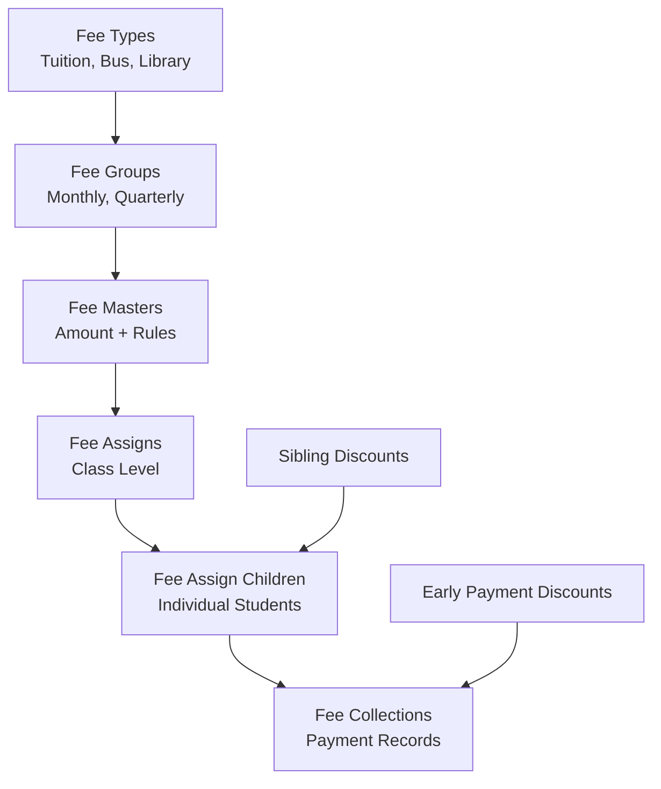
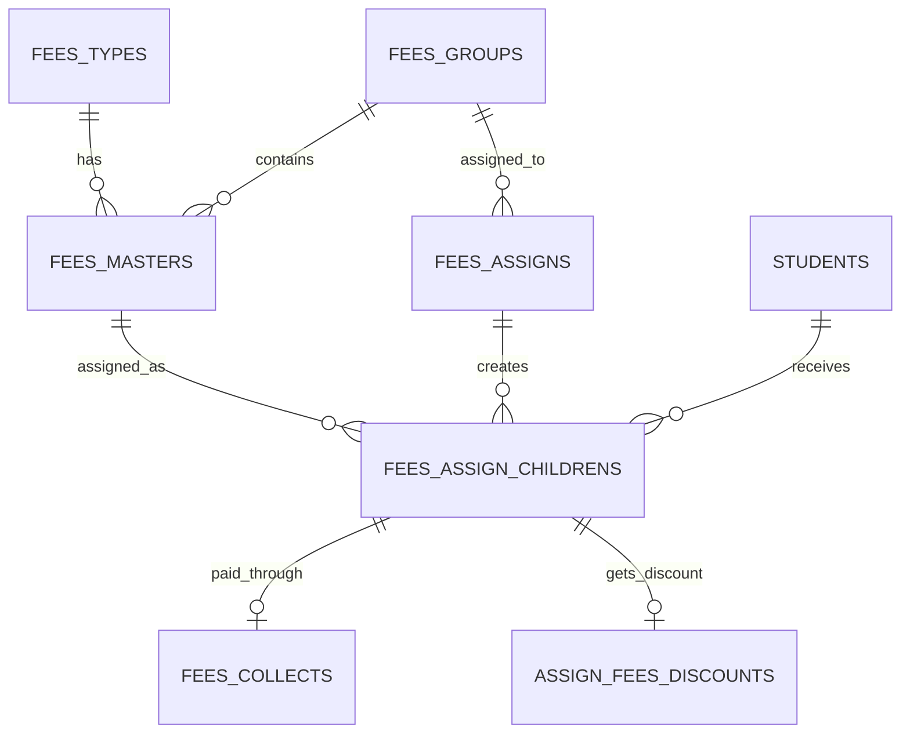
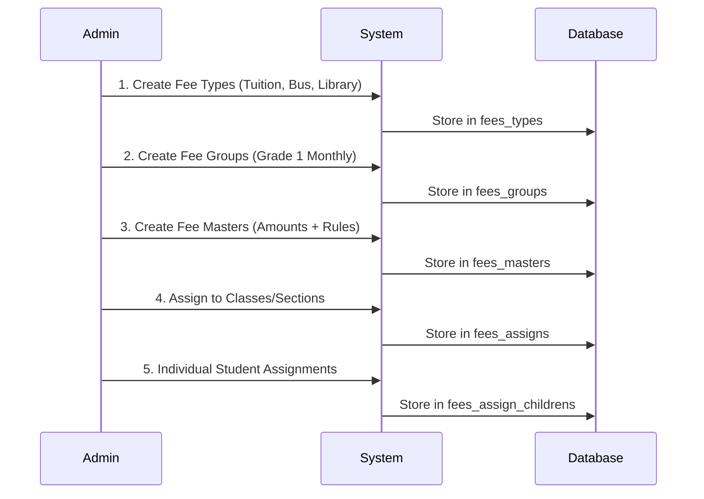
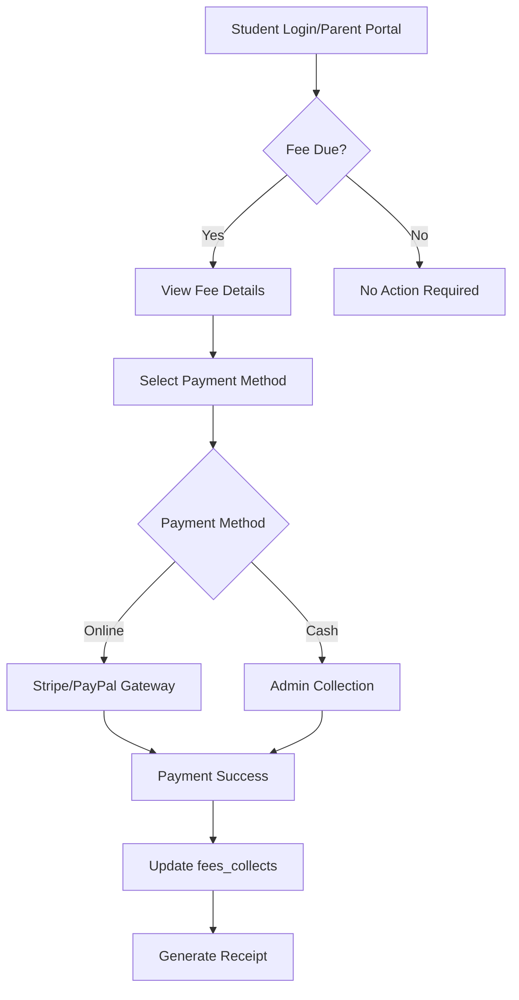

# Fee Module Architecture Analysis
**Laravel School Management System - Comprehensive Technical Documentation**

---

## Table of Contents

1. [Executive Summary](#1-executive-summary)
2. [Database Architecture](#2-database-architecture)
3. [Component Breakdown](#3-component-breakdown)
4. [Business Workflows](#4-business-workflows)
5. [Technical Implementation](#5-technical-implementation)
6. [Advanced Features](#6-advanced-features)
7. [Practical Use Cases](#7-practical-use-cases)
8. [Code Examples & Implementation](#8-code-examples--implementation)

---

## 1. Executive Summary

### Direct Answer: Tuition + Bus Fees Scenario

**Yes, this system perfectly handles your scenario where some students have tuition + bus fees while others have only tuition fees.**

The fee module uses a sophisticated **granular assignment architecture** through the `fees_assign_childrens` table, which allows each student to have a unique combination of fees:

- **Student A**: Tuition Fee ($500) + Bus Fee ($100) = $600 total
- **Student B**: Tuition Fee ($500) only = $500 total  
- **Student C**: Tuition Fee ($500) + Bus Fee ($100) + Library Fee ($25) = $625 total

### Architecture Overview



### Key Business Benefits

- **Flexible Fee Structure**: Create any combination of fee types per student
- **Automated Discounts**: Sibling discounts calculated automatically
- **Payment Integration**: Stripe and PayPal gateway support
- **Comprehensive Reporting**: Track collections, due fees, and payment history
- **Multi-tenant Support**: Works for both SaaS and single-school deployments
- **Bulk Operations**: Import/export fee assignments via Excel

---

## 2. Database Architecture

### Core Tables Overview

The fee module consists of **7 interconnected tables** working in a hierarchical structure:

#### 2.1 fees_types
**Purpose**: Defines categories of fees (Tuition, Bus, Library, etc.)

```sql
CREATE TABLE fees_types (
    id BIGINT PRIMARY KEY,
    name VARCHAR(255),           -- "Tuition Fee", "Bus Fee"
    code VARCHAR(255),           -- "TUITION", "BUS"
    description TEXT,
    status TINYINT DEFAULT 1,    -- Active/Inactive
    timestamps
);
```

**Sample Data**:
```sql
INSERT INTO fees_types VALUES
(1, 'Tuition Fee', 'TUITION', 'Monthly tuition fee', 1),
(2, 'Bus Fee', 'BUS', 'Transportation fee', 1),
(3, 'Library Fee', 'LIBRARY', 'Library access fee', 1);
```

#### 2.2 fees_groups  
**Purpose**: Groups fees by class/grade level or payment schedule

```sql
CREATE TABLE fees_groups (
    id BIGINT PRIMARY KEY,
    name VARCHAR(255),              -- "Grade 1 Monthly", "Grade 10 Quarterly"
    description TEXT,
    status TINYINT DEFAULT 1,
    online_admission_fees TINYINT DEFAULT 0,
    timestamps
);
```

#### 2.3 fees_masters
**Purpose**: The core fee structure combining group + type + amount + rules

```sql
CREATE TABLE fees_masters (
    id BIGINT PRIMARY KEY,
    session_id BIGINT,              -- Academic session
    fees_group_id BIGINT,           -- Links to fees_groups
    fees_type_id BIGINT,            -- Links to fees_types  
    due_date DATE,                  -- Payment due date
    amount DECIMAL(16,2),           -- Fee amount
    fine_type TINYINT DEFAULT 0,    -- 0=none, 1=percentage, 2=fixed
    percentage INT DEFAULT 0,       -- Fine percentage
    fine_amount DECIMAL(16,2),      -- Fixed fine amount
    status TINYINT DEFAULT 1,
    timestamps
);
```

**Example Fee Master**:
```sql
-- Grade 1 Tuition Fee = $500, due 15th of each month, 2% late fine
INSERT INTO fees_masters VALUES (
    1, 1, 1, 1, '2024-01-15', 500.00, 1, 2, 0.00, 1
);

-- Grade 1 Bus Fee = $100, due 15th of each month, $10 late fine  
INSERT INTO fees_masters VALUES (
    2, 1, 1, 2, '2024-01-15', 100.00, 2, 0, 10.00, 1
);
```

#### 2.4 fees_assigns
**Purpose**: Assigns fee groups to student segments (class/section/category/gender)

```sql
CREATE TABLE fees_assigns (
    id BIGINT PRIMARY KEY,
    session_id BIGINT,
    classes_id BIGINT,              -- Class assignment
    section_id BIGINT,              -- Section assignment  
    category_id BIGINT,             -- Student category (optional)
    gender_id BIGINT,               -- Gender filter (optional)
    fees_group_id BIGINT,           -- Which fee group applies
    timestamps
);
```

#### 2.5 fees_assign_childrens ⭐ **KEY TABLE**
**Purpose**: Individual student fee assignments - this enables the tuition+bus vs tuition-only flexibility

```sql
CREATE TABLE fees_assign_childrens (
    id BIGINT PRIMARY KEY,
    fees_assign_id BIGINT,          -- Links to fees_assigns
    fees_master_id BIGINT,          -- Specific fee master assigned
    student_id BIGINT,              -- Individual student
    timestamps
);
```

**Critical Example**:
```sql
-- Student ID 101: Gets both Tuition + Bus fees
INSERT INTO fees_assign_childrens VALUES
(1, 1, 1, 101), -- Tuition fee master
(2, 1, 2, 101); -- Bus fee master

-- Student ID 102: Gets only Tuition fee
INSERT INTO fees_assign_childrens VALUES
(3, 1, 1, 102); -- Only tuition fee master
```

#### 2.6 fees_collects
**Purpose**: Records actual payments made by students

```sql
CREATE TABLE fees_collects (
    id BIGINT PRIMARY KEY,
    date DATE,                           -- Payment date
    payment_method TINYINT,              -- Payment method
    payment_gateway VARCHAR(255),        -- Stripe/PayPal
    transaction_id VARCHAR(255),         -- Gateway transaction ID
    fees_assign_children_id BIGINT,      -- Links to specific fee assignment
    fees_collect_by BIGINT,              -- Staff member who collected
    student_id BIGINT,
    session_id BIGINT,
    amount DECIMAL(16,2),                -- Total amount paid (including fine)
    fine_amount DECIMAL(16,2),           -- Fine amount if late
    timestamps
);
```

#### 2.7 fees_master_childrens
**Purpose**: Links fee masters to multiple fee types (for composite fees)

```sql
CREATE TABLE fees_master_childrens (
    id BIGINT PRIMARY KEY,
    fees_master_id BIGINT,
    fees_type_id BIGINT,
    timestamps
);
```

### Entity Relationship Diagram



---

## 3. Component Breakdown

### 3.1 Fee Types Management

**Controllers**: `FeesTypeController`  
**Repository**: `FeesTypeRepository`  
**Model**: `FeesType`

**Key Features**:
- CRUD operations for fee categories
- Active/Inactive status management
- Code-based identification system

**Sample Fee Types**:
```php
$feeTypes = [
    ['name' => 'Tuition Fee', 'code' => 'TUITION'],
    ['name' => 'Bus Fee', 'code' => 'BUS'], 
    ['name' => 'Library Fee', 'code' => 'LIBRARY'],
    ['name' => 'Lab Fee', 'code' => 'LAB'],
    ['name' => 'Sports Fee', 'code' => 'SPORTS']
];
```

### 3.2 Fee Groups Management

**Controllers**: `FeesGroupController`  
**Repository**: `FeesGroupRepository`  
**Model**: `FeesGroup`

**Purpose**: Organize fees by class level or payment frequency

**Sample Fee Groups**:
```php
$feeGroups = [
    ['name' => 'Grade 1-5 Monthly', 'description' => 'Elementary monthly fees'],
    ['name' => 'Grade 6-10 Monthly', 'description' => 'Middle school monthly fees'],
    ['name' => 'Grade 11-12 Quarterly', 'description' => 'High school quarterly fees']
];
```

### 3.3 Fee Masters Management ⭐ **CORE COMPONENT**

**Controllers**: `FeesMasterController`  
**Repository**: `FeesMasterRepository`  
**Model**: `FeesMaster`

**Purpose**: Define actual fee amounts, due dates, and fine rules

**Key Features**:
- Amount specification per fee type
- Due date management
- Fine calculation rules (percentage or fixed)
- Session-based fee management

**Fine Types**:
```php
enum FineType {
    NONE = 0,        // No fine
    PERCENTAGE = 1,  // Percentage-based fine
    FIXED = 2        // Fixed amount fine
}
```

**Example Configuration**:
```php
// $500 tuition fee, due 15th, 2% late fine
$tuitionMaster = [
    'fees_group_id' => 1,
    'fees_type_id' => 1,  // Tuition
    'amount' => 500.00,
    'due_date' => '2024-01-15',
    'fine_type' => FineType::PERCENTAGE,
    'percentage' => 2
];

// $100 bus fee, due 15th, $10 fixed late fine
$busMaster = [
    'fees_group_id' => 1,
    'fees_type_id' => 2,  // Bus
    'amount' => 100.00,
    'due_date' => '2024-01-15', 
    'fine_type' => FineType::FIXED,
    'fine_amount' => 10.00
];
```

### 3.4 Fee Assignment System ⭐ **FLEXIBILITY ENGINE**

**Controllers**: `FeesAssignController`  
**Repository**: `FeesAssignRepository`  
**Models**: `FeesAssign`, `FeesAssignChildren`

**Two-Level Assignment**:

1. **Class Level** (`fees_assigns`): Assign fee groups to entire classes/sections
2. **Individual Level** (`fees_assign_childrens`): Granular assignment per student

**Critical Repository Logic**:
```php
// From FeesAssignRepository::store()
foreach ($request->fees_master_ids as $fees_master) {
    foreach ($request->student_ids as $student_id) {
        $alreadyAssigned = FeesAssignChildren::where('fees_master_id', $fees_master)
            ->where('student_id', $student_id)
            ->exists();
            
        if(!$alreadyAssigned) {
            $feesChild = new FeesAssignChildren();
            $feesChild->fees_assign_id = $row->id;
            $feesChild->fees_master_id = $fees_master;
            $feesChild->student_id = $student_id;
            $feesChild->save();
        }
    }
}
```

**This is how your tuition+bus vs tuition-only scenario works!**

### 3.5 Fee Collection System

**Controllers**: `FeesCollectController`  
**Repository**: `FeesCollectRepository`  
**Model**: `FeesCollect`

**Key Features**:
- Payment method tracking (Cash, Card, Online)
- Payment gateway integration (Stripe, PayPal)
- Transaction ID recording
- Fine calculation and collection
- Receipt generation

**Payment Methods**:
```php
$paymentMethods = [
    1 => 'Cash',
    2 => 'Card', 
    3 => 'Bank Transfer',
    4 => 'Stripe',
    5 => 'PayPal'
];
```

### 3.6 Discount System

**Models**: `AssignFeesDiscount`, `SiblingFeesDiscount`

**Types of Discounts**:

1. **Sibling Discounts**: Automatic discounts for families with multiple students
2. **Early Payment Discounts**: Discounts for paying before due date

**Automatic Sibling Discount Logic**:
```php
// From FeesAssignRepository
if ($student->siblings_discount == 1) {
    $data = $this->studentRepo->getSiblingsDiscount($student->parent_guardian_id);
    $assignFeesDiscount = new AssignFeesDiscount();
    $assignFeesDiscount->fees_assign_children_id = $feesChild->id;
    $assignFeesDiscount->title = $data->discount_title;
    
    $discountPercentage = $data->discount_percentage;
    $totalAmount = FeesMaster::active()->whereIn('id', $request->fees_master_ids)->sum('amount');
    $discountAmount = round(($discountPercentage / 100) * $totalAmount, 2);
    $assignFeesDiscount->discount_amount = $discountAmount;
    $assignFeesDiscount->save();
}
```

---

## 4. Business Workflows

### 4.1 Initial Fee Setup Workflow (Admin)



### 4.2 Student Fee Assignment Process

**Step 1: Class-Level Assignment**
```php
// Assign "Grade 1 Monthly" fee group to Class 1, Section A
$feesAssign = new FeesAssign([
    'session_id' => 1,
    'classes_id' => 1,      // Grade 1
    'section_id' => 1,      // Section A
    'fees_group_id' => 1,   // Grade 1 Monthly fees
]);
```

**Step 2: Individual Fee Selection**
```php
// For your tuition+bus vs tuition-only scenario:

// Student 101: Gets Tuition + Bus
FeesAssignChildren::create([
    'fees_assign_id' => 1,
    'fees_master_id' => 1,  // Tuition Master
    'student_id' => 101
]);
FeesAssignChildren::create([
    'fees_assign_id' => 1, 
    'fees_master_id' => 2,  // Bus Master
    'student_id' => 101
]);

// Student 102: Gets Tuition Only
FeesAssignChildren::create([
    'fees_assign_id' => 1,
    'fees_master_id' => 1,  // Only Tuition Master
    'student_id' => 102
]);
```

### 4.3 Payment Collection Workflow



### 4.4 Fine Calculation Process

```php
// Automatic fine calculation when payment is overdue
public function calculateFine($feesMaster, $currentDate) {
    if ($currentDate > $feesMaster->due_date) {
        switch ($feesMaster->fine_type) {
            case FineType::PERCENTAGE:
                return ($feesMaster->amount * $feesMaster->percentage) / 100;
                
            case FineType::FIXED:
                return $feesMaster->fine_amount;
                
            default:
                return 0;
        }
    }
    return 0;
}
```

---

## 5. Technical Implementation

### 5.1 Repository Pattern Architecture

The system follows **Repository Pattern** with clean interfaces:

```php
// Interface Definition
interface FeesAssignInterface {
    public function all();
    public function store($request);
    public function show($id);
    public function update($request, $id);
    public function destroy($id);
}

// Repository Implementation
class FeesAssignRepository implements FeesAssignInterface {
    use ReturnFormatTrait;
    
    private $model;
    
    public function __construct(FeesAssign $model) {
        $this->model = $model;
    }
    
    public function store($request) {
        DB::beginTransaction();
        try {
            // Complex business logic here
            DB::commit();
            return $this->responseWithSuccess('Created successfully');
        } catch (\Throwable $th) {
            DB::rollBack();
            return $this->responseWithError('Something went wrong');
        }
    }
}
```

### 5.2 Controller Structure

Controllers are thin and delegate to repositories:

```php
class FeesAssignController extends Controller {
    private $repo;
    private $feesMasterRepo;
    private $studentRepo;
    
    public function __construct(
        FeesAssignInterface $repo,
        FeesMasterRepository $feesMasterRepo,
        StudentRepository $studentRepo
    ) {
        $this->repo = $repo;
        $this->feesMasterRepo = $feesMasterRepo;
        $this->studentRepo = $studentRepo;
    }
    
    public function store(FeesAssignStoreRequest $request) {
        $result = $this->repo->store($request);
        
        if($result['status']) {
            return redirect()->route('fees-assign.index')
                ->with('success', $result['message']);
        }
        
        return back()->with('danger', $result['message'])->withInput();
    }
}
```

### 5.3 Model Relationships

**FeesAssign Model**:
```php
class FeesAssign extends BaseModel {
    public function class() {
        return $this->belongsTo(Classes::class, 'classes_id', 'id');
    }
    
    public function section() {
        return $this->belongsTo(Section::class, 'section_id', 'id');
    }
    
    public function feesGroup() {
        return $this->belongsTo(FeesGroup::class, 'fees_group_id', 'id');
    }
    
    public function feesAssignChilds() {
        return $this->hasMany(FeesAssignChildren::class, 'fees_assign_id', 'id');
    }
}
```

**FeesAssignChildren Model** (The flexibility key):
```php
class FeesAssignChildren extends BaseModel {
    public function student() {
        return $this->belongsTo(Student::class, 'student_id', 'id');
    }
    
    public function feesMaster() {
        return $this->belongsTo(FeesMaster::class, 'fees_master_id', 'id');
    }
    
    public function feesCollect() {
        return $this->hasOne(FeesCollect::class, 'fees_assign_children_id', 'id');
    }
    
    public function feesDiscount() {
        return $this->hasOne(AssignFeesDiscount::class, 'fees_assign_children_id', 'id');
    }
}
```

### 5.4 Request Validation

```php
class FeesAssignStoreRequest extends FormRequest {
    public function rules() {
        return [
            'class' => 'required|exists:classes,id',
            'section' => 'required|exists:sections,id', 
            'fees_group' => 'required|exists:fees_groups,id',
            'student_ids' => 'required|array',
            'student_ids.*' => 'exists:students,id',
            'fees_master_ids' => 'required|array',
            'fees_master_ids.*' => 'exists:fees_masters,id'
        ];
    }
}
```

---

## 6. Advanced Features

### 6.1 Payment Gateway Integration

**Supported Gateways**: Stripe, PayPal

**Payment Flow**:
```php
// fees_collects table structure for payments
$paymentData = [
    'date' => now(),
    'payment_method' => 4, // Stripe
    'payment_gateway' => 'stripe',
    'transaction_id' => 'txn_1234567890',
    'fees_assign_children_id' => $feeAssignChildId,
    'student_id' => $studentId,
    'amount' => $totalAmount, // Including fine if applicable
    'fine_amount' => $fineAmount
];
```

**Gateway Configuration** (from config/site.php):
```php
'payment_methods' => [
    'stripe' => [
        'name' => 'Stripe',
        'status' => true
    ],
    'paypal' => [
        'name' => 'PayPal', 
        'status' => true
    ]
]
```

### 6.2 Bulk Operations

**Bulk Fee Assignment via Excel Import**:

Route: `fees-assign/import`  
Controller: `FeesAssignController@importSubmit`  
Import Class: `FeesImport`

**Sample Excel Format**:
| Student ID | Fees Master ID | Class | Section |
|------------|----------------|-------|---------|
| 101        | 1,2           | 1     | 1       |
| 102        | 1             | 1     | 1       |
| 103        | 1,2,3         | 1     | 1       |

This allows bulk assignment where:
- Student 101: Gets fee masters 1,2 (Tuition + Bus)
- Student 102: Gets fee master 1 only (Tuition only)
- Student 103: Gets fee masters 1,2,3 (Tuition + Bus + Library)

### 6.3 Discount Calculations

**Sibling Discount System**:
```php
class SiblingFeesDiscount extends Model {
    protected $fillable = [
        'discount_title',      // "2 Children - 10% Off"
        'siblings_number',     // Minimum siblings count
        'discount_percentage'  // Discount percentage
    ];
}
```

**Early Payment Discount**:
Configured per school with global settings applied automatically when payments are made before due dates.

### 6.4 Comprehensive Reporting

**Available Reports**:

1. **Due Fees Report** (`DueFeesController`)
   - Students with outstanding payments
   - Amount due with fine calculations
   - Payment history

2. **Fees Collection Report** (`FeesCollectionController`)
   - Payment collections by date range
   - Payment method breakdown
   - Revenue analysis

3. **PDF Generation**: Both reports support PDF export for official documentation

### 6.5 Multi-tenant Support

**Tenant Isolation**: Uses `stancl/tenancy` middleware

```php
Route::middleware([
    'saas' => saasMiddleware(),
    'FeatureCheck:fees'
])->group(function () {
    // All fee routes are tenant-isolated
});
```

**Session-based Management**: All fees are tied to academic sessions, allowing schools to manage fees across different academic years.

---

## 7. Practical Use Cases

### 7.1 Your Scenario: Mixed Fee Requirements

**School Setup**:
- Some students need Bus transportation
- All students pay Tuition
- Optional Library access fee

**Implementation Steps**:

1. **Create Fee Types**:
```php
FeesType::create(['name' => 'Tuition Fee', 'code' => 'TUITION']);
FeesType::create(['name' => 'Bus Fee', 'code' => 'BUS']);
FeesType::create(['name' => 'Library Fee', 'code' => 'LIBRARY']);
```

2. **Create Fee Group**:
```php
FeesGroup::create([
    'name' => 'Grade 1 Monthly',
    'description' => 'Grade 1 monthly fee structure'
]);
```

3. **Create Fee Masters**:
```php
// Tuition Fee Master - $500
FeesMaster::create([
    'fees_group_id' => 1,
    'fees_type_id' => 1, // Tuition
    'amount' => 500.00,
    'due_date' => '2024-01-15'
]);

// Bus Fee Master - $100
FeesMaster::create([
    'fees_group_id' => 1,
    'fees_type_id' => 2, // Bus
    'amount' => 100.00,
    'due_date' => '2024-01-15'
]);

// Library Fee Master - $25
FeesMaster::create([
    'fees_group_id' => 1,
    'fees_type_id' => 3, // Library
    'amount' => 25.00,
    'due_date' => '2024-01-15'
]);
```

4. **Individual Student Assignments**:
```php
// Student requiring Bus service
$student101Fees = [
    ['fees_master_id' => 1, 'student_id' => 101], // Tuition
    ['fees_master_id' => 2, 'student_id' => 101], // Bus
];

// Student without Bus service  
$student102Fees = [
    ['fees_master_id' => 1, 'student_id' => 102], // Tuition only
];

// Student with Library access but no Bus
$student103Fees = [
    ['fees_master_id' => 1, 'student_id' => 103], // Tuition
    ['fees_master_id' => 3, 'student_id' => 103], // Library
];
```

**Result**:
- Student 101: $600/month (Tuition + Bus)
- Student 102: $500/month (Tuition only)
- Student 103: $525/month (Tuition + Library)

### 7.2 Seasonal Fee Variations

**Scenario**: Summer months have reduced fees, winter months have heating charges

```php
// Summer Fee Group (June-August)
FeesGroup::create(['name' => 'Summer Reduced Fees']);

// Winter Fee Group (December-February)  
FeesGroup::create(['name' => 'Winter Enhanced Fees']);

// Different fee masters for each season with varying amounts
FeesMaster::create([
    'fees_group_id' => 2, // Summer
    'fees_type_id' => 1,  // Tuition
    'amount' => 400.00    // Reduced summer tuition
]);

FeesMaster::create([
    'fees_group_id' => 3, // Winter  
    'fees_type_id' => 1,  // Tuition
    'amount' => 600.00    // Increased winter tuition
]);
```

### 7.3 Grade-based Fee Structure

```php
// Elementary fees
FeesGroup::create(['name' => 'Elementary (Grades 1-5)']);
FeesMaster::create(['fees_group_id' => 1, 'amount' => 400.00]);

// Middle school fees
FeesGroup::create(['name' => 'Middle School (Grades 6-8)']); 
FeesMaster::create(['fees_group_id' => 2, 'amount' => 550.00]);

// High school fees
FeesGroup::create(['name' => 'High School (Grades 9-12)']);
FeesMaster::create(['fees_group_id' => 3, 'amount' => 700.00]);
```

### 7.4 Scholarship and Discount Scenarios

**Automatic Sibling Discounts**:
- 2 children: 10% discount on total fees
- 3+ children: 15% discount on total fees

**Early Payment Incentives**:
- Pay by 5th of month: 3% discount
- Pay by 10th of month: 1% discount
- After due date: Late fine applies

---

## 8. Code Examples & Implementation

### 8.1 Complete Fee Assignment Example

```php
<?php
// Complete workflow for assigning mixed fees to students

class SchoolFeeSetup {
    public function setupMixedFeeScenario() {
        DB::beginTransaction();
        
        try {
            // Step 1: Create Fee Types
            $tuitionType = FeesType::create([
                'name' => 'Tuition Fee',
                'code' => 'TUITION',
                'description' => 'Monthly tuition fee'
            ]);
            
            $busType = FeesType::create([
                'name' => 'Bus Fee', 
                'code' => 'BUS',
                'description' => 'Transportation fee'
            ]);
            
            // Step 2: Create Fee Group
            $monthlyGroup = FeesGroup::create([
                'name' => 'Grade 1 Monthly',
                'description' => 'Monthly fees for Grade 1 students'
            ]);
            
            // Step 3: Create Fee Masters
            $tuitionMaster = FeesMaster::create([
                'session_id' => setting('session'),
                'fees_group_id' => $monthlyGroup->id,
                'fees_type_id' => $tuitionType->id,
                'amount' => 500.00,
                'due_date' => '2024-01-15',
                'fine_type' => FineType::PERCENTAGE,
                'percentage' => 2
            ]);
            
            $busMaster = FeesMaster::create([
                'session_id' => setting('session'),
                'fees_group_id' => $monthlyGroup->id, 
                'fees_type_id' => $busType->id,
                'amount' => 100.00,
                'due_date' => '2024-01-15',
                'fine_type' => FineType::FIXED,
                'fine_amount' => 10.00
            ]);
            
            // Step 4: Class Level Assignment
            $feesAssign = FeesAssign::create([
                'session_id' => setting('session'),
                'classes_id' => 1, // Grade 1
                'section_id' => 1, // Section A
                'fees_group_id' => $monthlyGroup->id
            ]);
            
            // Step 5: Individual Student Assignments
            $studentsWithBus = [101, 103, 105]; // Students who need bus
            $studentsWithoutBus = [102, 104, 106]; // Students who don't need bus
            
            // Assign tuition to all students
            $allStudents = array_merge($studentsWithBus, $studentsWithoutBus);
            foreach ($allStudents as $studentId) {
                FeesAssignChildren::create([
                    'fees_assign_id' => $feesAssign->id,
                    'fees_master_id' => $tuitionMaster->id,
                    'student_id' => $studentId
                ]);
            }
            
            // Assign bus fee only to students who need it
            foreach ($studentsWithBus as $studentId) {
                FeesAssignChildren::create([
                    'fees_assign_id' => $feesAssign->id,
                    'fees_master_id' => $busMaster->id,
                    'student_id' => $studentId
                ]);
            }
            
            DB::commit();
            
            return [
                'status' => true,
                'message' => 'Mixed fee scenario setup completed successfully'
            ];
            
        } catch (\Exception $e) {
            DB::rollBack();
            return [
                'status' => false,
                'message' => 'Setup failed: ' . $e->getMessage()
            ];
        }
    }
}
```

### 8.2 Fee Calculation Service

```php
<?php

class FeeCalculationService {
    
    public function calculateStudentFees($studentId, $month = null) {
        $month = $month ?? now()->format('Y-m');
        
        // Get all assigned fees for student
        $assignedFees = FeesAssignChildren::where('student_id', $studentId)
            ->with(['feesMaster.type', 'feesDiscount'])
            ->get();
        
        $totalAmount = 0;
        $totalDiscount = 0;
        $fineAmount = 0;
        $breakdown = [];
        
        foreach ($assignedFees as $assignment) {
            $feesMaster = $assignment->feesMaster;
            $baseAmount = $feesMaster->amount;
            
            // Calculate discount if applicable
            $discount = 0;
            if ($assignment->feesDiscount) {
                $discount = $assignment->feesDiscount->discount_amount;
                $totalDiscount += $discount;
            }
            
            // Calculate fine if overdue
            $fine = 0;
            $dueDate = Carbon::parse($feesMaster->due_date);
            if (now()->isAfter($dueDate)) {
                $fine = $this->calculateFine($feesMaster);
                $fineAmount += $fine;
            }
            
            $netAmount = $baseAmount - $discount + $fine;
            $totalAmount += $netAmount;
            
            $breakdown[] = [
                'type' => $feesMaster->type->name,
                'base_amount' => $baseAmount,
                'discount' => $discount,
                'fine' => $fine,
                'net_amount' => $netAmount
            ];
        }
        
        return [
            'student_id' => $studentId,
            'month' => $month,
            'breakdown' => $breakdown,
            'total_base' => array_sum(array_column($breakdown, 'base_amount')),
            'total_discount' => $totalDiscount,
            'total_fine' => $fineAmount,
            'total_payable' => $totalAmount
        ];
    }
    
    private function calculateFine($feesMaster) {
        switch ($feesMaster->fine_type) {
            case FineType::PERCENTAGE:
                return round(($feesMaster->amount * $feesMaster->percentage) / 100, 2);
                
            case FineType::FIXED:
                return $feesMaster->fine_amount;
                
            default:
                return 0;
        }
    }
}
```

### 8.3 Payment Processing Example

```php
<?php

class PaymentProcessor {
    
    public function processPayment($studentId, $paymentData) {
        DB::beginTransaction();
        
        try {
            // Get outstanding fees for student
            $outstandingFees = FeesAssignChildren::where('student_id', $studentId)
                ->whereDoesntHave('feesCollect')
                ->with('feesMaster')
                ->get();
            
            $totalPaid = 0;
            
            foreach ($outstandingFees as $feeAssignment) {
                if ($totalPaid >= $paymentData['amount']) {
                    break; // Payment amount exhausted
                }
                
                $feeAmount = $feeAssignment->feesMaster->amount;
                $fine = $this->calculateFine($feeAssignment->feesMaster);
                $totalRequired = $feeAmount + $fine;
                
                $amountToPay = min($totalRequired, $paymentData['amount'] - $totalPaid);
                
                // Record payment
                FeesCollect::create([
                    'date' => now(),
                    'payment_method' => $paymentData['payment_method'],
                    'payment_gateway' => $paymentData['payment_gateway'] ?? null,
                    'transaction_id' => $paymentData['transaction_id'] ?? null,
                    'fees_assign_children_id' => $feeAssignment->id,
                    'fees_collect_by' => auth()->id(),
                    'student_id' => $studentId,
                    'session_id' => setting('session'),
                    'amount' => $amountToPay,
                    'fine_amount' => min($fine, $amountToPay)
                ]);
                
                $totalPaid += $amountToPay;
            }
            
            DB::commit();
            
            return [
                'status' => true,
                'amount_paid' => $totalPaid,
                'message' => 'Payment processed successfully'
            ];
            
        } catch (\Exception $e) {
            DB::rollBack();
            return [
                'status' => false,
                'message' => 'Payment failed: ' . $e->getMessage()
            ];
        }
    }
}
```

### 8.4 Reporting Queries

```php
<?php

class FeeReports {
    
    // Get students with outstanding fees (your tuition+bus scenario)
    public function getDueFees($classId = null, $sectionId = null) {
        $query = Student::with([
            'feesAssignChildrens.feesMaster.type',
            'feesAssignChildrens.feesCollect'
        ])
        ->whereHas('feesAssignChildrens', function($q) {
            $q->whereDoesntHave('feesCollect');
        });
        
        if ($classId) {
            $query->where('classes_id', $classId);
        }
        
        if ($sectionId) {
            $query->where('section_id', $sectionId);
        }
        
        return $query->get()->map(function($student) {
            $outstandingFees = $student->feesAssignChildrens
                ->where('feesCollect', null);
            
            $breakdown = [];
            $totalDue = 0;
            
            foreach ($outstandingFees as $fee) {
                $amount = $fee->feesMaster->amount;
                $fine = $this->calculateFine($fee->feesMaster);
                $total = $amount + $fine;
                
                $breakdown[] = [
                    'type' => $fee->feesMaster->type->name,
                    'amount' => $amount,
                    'fine' => $fine,
                    'total' => $total
                ];
                
                $totalDue += $total;
            }
            
            return [
                'student' => $student,
                'breakdown' => $breakdown,
                'total_due' => $totalDue
            ];
        });
    }
    
    // Collection report by date range
    public function getCollectionReport($startDate, $endDate) {
        return FeesCollect::with([
            'student',
            'feesAssignChildren.feesMaster.type'
        ])
        ->whereBetween('date', [$startDate, $endDate])
        ->get()
        ->groupBy(function($payment) {
            return $payment->feesAssignChildren->feesMaster->type->name;
        })
        ->map(function($payments, $feeType) {
            return [
                'fee_type' => $feeType,
                'total_collected' => $payments->sum('amount'),
                'total_fine_collected' => $payments->sum('fine_amount'),
                'payment_count' => $payments->count(),
                'students' => $payments->count('student_id')
            ];
        });
    }
}
```

---

## Conclusion

This fee module provides a **highly flexible and comprehensive solution** for school fee management. The key architectural decision of using `fees_assign_childrens` as the granular assignment table enables your specific scenario where:

- **Some students pay Tuition + Bus fees**
- **Others pay Tuition fees only**
- **Future expansion allows any combination** (Tuition + Library, Tuition + Bus + Sports, etc.)

The system's strengths include:

✅ **Granular Control**: Individual student fee customization  
✅ **Automated Discounts**: Sibling and early payment discounts  
✅ **Payment Integration**: Stripe/PayPal gateway support  
✅ **Comprehensive Reporting**: Due fees, collections, and analytics  
✅ **Bulk Operations**: Excel import/export for efficiency  
✅ **Multi-tenant Ready**: Supports both SaaS and single-school deployments  

The architecture follows Laravel best practices with Repository pattern, proper validation, database transactions, and clean separation of concerns, making it maintainable and extensible for future requirements.