# Fee Management System Refactoring Plan
## Comprehensive Enhancement Strategy for Service-Based Fee Assignment

---

## Executive Summary

This comprehensive plan addresses three critical issues in the current fee management system while leveraging the existing sophisticated fee generation infrastructure:

1. **Service-Based Automatic Fee Assignment** - Eliminate manual fee component selection through student service profiles
2. **Academic Level Fee Group Association** - Link fee groups to class levels preventing wrong group selection  
3. **Enhanced Individual Student Flexibility** - Expand discount system for complex real-world scenarios

The solution preserves all existing bulk fee generation capabilities while adding intelligent automation and flexibility.

---

## Current System Analysis

### Existing Strengths (To Preserve)
- **FeesGenerationService** - Robust bulk fee assignment with batch processing
- **FeesGeneration Model** - Comprehensive tracking of bulk operations with audit trails
- **Preview Functionality** - Validation and estimation before fee generation
- **Batch Management** - Efficient processing with real-time progress tracking
- **Duplicate Prevention** - Sophisticated mechanisms to avoid duplicate fee assignments
- **Transaction Safety** - Complete rollback capability for failed operations

### Current Architecture Components
```
FeesGroup → FeesAssign → FeesAssignChildren → FeesCollect
     ↓           ↓              ↓                ↓
Fee Groups   Assignment    Individual      Payment
             Rules        Student Fees     Records
```

### Identified Problems

#### Problem 1: Manual Fee Component Assignment
**Current Issue**: Administrators manually decide which fee types (tuition, bus, books, etc.) to assign to students
- **Risk**: Human error in service assignment
- **Inefficiency**: Time-consuming manual process
- **Inconsistency**: Different treatment for similar students

**Real-World Example**: 
- Student A needs tuition + bus fee
- Student B needs tuition + bus + library fee  
- Currently: Admin manually selects components for each student group
- **Proposed**: Automatic assignment based on student service subscriptions

#### Problem 2: Error-Prone Fee Group Selection
**Current Issue**: Fee groups not automatically linked to student academic levels
- **Risk**: Accidentally assigning "Primary Fee Group" to secondary students
- **Example**: Form 3 class getting primary school fees instead of secondary fees
- **Impact**: Incorrect billing amounts and administrative corrections

**Real-World Scenario**:
- Form 3 students should get "Secondary Fee Group" ($30 tuition + $15 bus)
- Admin accidentally selects "Primary Fee Group" ($20 tuition + $10 bus)  
- Result: Students undercharged, revenue loss, manual corrections needed

#### Problem 3: Limited Individual Discount Flexibility
**Current Issue**: System lacks comprehensive individual adjustment capabilities
- **Scenario**: Secondary student's total fees = $45 (tuition $30 + bus $15)
- **Need**: Special rate of $35 for financial hardship case
- **Current Limitation**: Basic discount system cannot handle complex scenarios

**Required Flexibility**:
- Percentage discounts per fee type
- Fixed amount discounts across all fees
- Complete fee amount overrides
- Sibling discounts with approval workflows
- Merit-based scholarships with varying percentages

---

## Implementation Workflow for New Schools

### Complete Setup and Operation Workflow

When deploying this system to a new school, the fee service assignment follows a structured three-phase approach that separates initial configuration from ongoing operations.

#### Phase A: Initial System Configuration (One-Time Setup)

**1. Fee Service Definition**
The school administrator first defines all available services in the system:

```
Academic Services:
- Tuition Fee (Core - Required for all students)
- Lab Fees (Optional - Based on subject selection)
- Library Access (Optional - Based on usage needs)
- Exam Fees (Core - Required for all students)

Transport Services:
- Bus Service Route A (Optional - Specific route coverage)
- Bus Service Route B (Optional - Different route coverage)
- Bus Service Route C (Optional - Premium route service)

Meal Services:
- Full Meal Plan (Optional - Breakfast + Lunch)
- Lunch Only Plan (Optional - Lunch service only)
- Snack Program (Optional - Break time snacks)

Material Services:
- Textbooks Package (Core - Required academic materials)
- Uniform Package (Core - Required school attire)
- Stationery Kit (Optional - Learning materials)

Special Programs:
- Sports Program (Optional - Athletic activities)
- Music Classes (Optional - Instrumental training)
- After School Care (Optional - Extended supervision)
```

**2. Academic Level Configuration**
Administrator sets up academic level templates with default service requirements:

```
Academic Level: Primary (Classes 1-5)
Required Services: Tuition, Textbooks, Uniform
Optional Services: Bus Transport, Meals, Sports, Music

Academic Level: Secondary (Classes 6-10)  
Required Services: Tuition, Lab Fees, Textbooks, Uniform
Optional Services: Bus Transport, Meals, Sports, Music, After Care

Academic Level: Advanced (Classes 11-12)
Required Services: Tuition, Lab Fees, Exam Fees, Textbooks
Optional Services: Bus Transport, Meals, Special Programs
```

**3. Service Pricing Configuration**
Set base amounts for each service by academic level:

```
Primary Level Services:
- Tuition: $200/month
- Textbooks: $50/semester  
- Bus Route A: $30/month
- Full Meals: $40/month

Secondary Level Services:
- Tuition: $300/month
- Lab Fees: $25/month
- Textbooks: $75/semester
- Bus Route A: $35/month
```

#### Phase B: Student Registration and Service Assignment

**During New Student Registration Process:**

**Step 1: Basic Information Collection**
```
Student Registration Form:
- Name: John Smith
- Academic Level: Secondary (Class 8)
- Parent Contact: parent@email.com
```

**Step 2: Automatic Service Determination**
System automatically determines required services based on academic level:
```
Auto-Selected Services (Required):
✓ Tuition Fee - $300/month
✓ Lab Fees - $25/month  
✓ Textbooks - $75/semester
✓ Uniform Package - $60/year
```

**Step 3: Optional Service Selection**
Parent/administrator selects additional services:
```
Optional Service Selection:
Transport Needs:
□ No Transport Required
□ Bus Route A ($35/month)
☑ Bus Route B ($40/month) [SELECTED]
□ Bus Route C ($45/month)

Meal Requirements:
□ No Meal Service
☑ Lunch Only ($25/month) [SELECTED]
□ Full Meal Plan ($40/month)

Additional Programs:
☑ Sports Program ($20/month) [SELECTED]
□ Music Classes ($30/month)
□ After School Care ($50/month)
```

**Step 4: Service Assignment Storage**
System creates database records linking student to selected services:
```sql
-- Student service subscriptions created
INSERT INTO student_service_subscriptions:
- John Smith → Tuition (required)
- John Smith → Lab Fees (required)  
- John Smith → Textbooks (required)
- John Smith → Bus Route B (optional - selected)
- John Smith → Lunch Plan (optional - selected)
- John Smith → Sports Program (optional - selected)
```

**Step 5: Fee Profile Creation**
Student's complete fee profile is now established:
```
John Smith Fee Profile:
Required: $300 + $25 + $75 = $400/month base
Optional: $40 + $25 + $20 = $85/month additional  
Total Monthly Fees: $485
```

#### Phase C: Periodic Fee Generation (Monthly/Quarterly Operations)

**When Administrator Runs Monthly Fee Generation:**

**Step 1: Student Service Lookup**
System reads each student's existing service assignments:
```php
// For each student in the class
$johnServices = StudentServiceSubscription::where('student_id', $john->id)
    ->active()
    ->with('feeService')
    ->get();

// Results: Tuition, Lab Fees, Textbooks, Bus Route B, Lunch, Sports
```

**Step 2: Fee Amount Calculation**
System calculates fees based on assigned services:
```php
$totalFees = 0;
foreach ($johnServices as $subscription) {
    $service = $subscription->feeService;
    $monthlyAmount = $service->getMonthlyAmount(); // Based on service type
    $totalFees += $monthlyAmount;
}
// John's March 2025 fees: $485
```

**Step 3: Individual Adjustments Application**
System applies any approved discounts or adjustments:
```php
$adjustments = StudentFeeAdjustment::where('student_id', $john->id)
    ->approved()
    ->validForDate(now())
    ->get();
    
// Example: 10% sibling discount = $48.50 reduction
// Final amount: $485 - $48.50 = $436.50
```

**Step 4: Fee Record Creation**
System creates billable fee records for the period:
```sql
INSERT INTO fees_collects (
    student_id: John Smith ID,
    amount: $436.50,
    month: March,
    year: 2025,
    service_breakdown: JSON of all services and amounts
);
```

### Key Workflow Insights

#### Service Assignment is "Set Once, Use Always"
- Services are assigned ONCE during registration (or when changed)
- Fee generation READS these existing assignments repeatedly
- No re-determination needed during each billing cycle

#### Automatic vs Manual Assignment
```
Academic Level → Auto-determines → Required Services (Tuition, etc.)
Parent Choice → Manual selection → Optional Services (Bus, Meals, etc.)
System Logic → Combines both → Complete Service Profile
```

#### Service Change Workflow
When students need service changes mid-year:

```
Process Flow:
1. Parent requests bus service addition
2. Administrator updates service subscription
3. System adds bus service to student profile
4. Next fee generation automatically includes bus fees
5. Pro-rated billing for partial month if needed
```

#### Migration from Existing Systems
For schools currently using the fee group system:

```
Migration Process:
1. Analyze current fee group assignments
2. Map fee types to new service categories
3. Create service subscriptions for existing students
4. Verify fee amounts match historical billing
5. Switch to service-based generation gradually
```

### Workflow Benefits

#### Eliminates Manual Errors
- **Before**: Admin manually selects fee components for each student group
- **After**: System automatically includes appropriate fees based on services

#### Prevents Academic Level Mismatches  
- **Before**: Risk of selecting "Primary fees" for Secondary students
- **After**: Fee groups filtered by academic level, preventing mismatches

#### Enables Individual Flexibility
- **Before**: Fixed fee structures with limited discount options
- **After**: Flexible service subscriptions + individual adjustments

#### Maintains Bulk Processing Efficiency
- **Before**: Bulk generation for entire classes
- **After**: Same bulk processing, but intelligent per-student service consideration

This workflow ensures that when schools implement the enhanced system, they have a clear path from initial setup through daily operations, with service assignments happening during registration and fee generation using those existing assignments for optimal efficiency.

### UI/UX Implementation Workflow

#### Admin Interface Flow

**1. Initial Setup Screens**
```
Admin Dashboard → School Configuration → Fee Services Management

Fee Services Setup Form:
┌─────────────────────────────────────────────┐
│ Add New Fee Service                         │
├─────────────────────────────────────────────┤
│ Service Name: [Bus Transportation Route A]  │
│ Category: [Transport ▼]                     │
│ Service Type: ○ Required  ● Optional        │
│ Academic Levels: ☑ Primary ☑ Secondary     │
│ Monthly Rate: [$35.00]                      │
│ Description: [Daily bus service...]         │
│                                             │
│ [Cancel] [Save Service]                     │
└─────────────────────────────────────────────┘
```

**2. Academic Level Configuration**  
```
Academic Levels → Primary Level → Service Requirements

Primary Level Configuration:
┌─────────────────────────────────────────────┐
│ Academic Level: Primary (Classes 1-5)      │
├─────────────────────────────────────────────┤
│ Required Services:                          │
│ ☑ Tuition Fee                              │
│ ☑ Textbooks Package                        │
│ ☑ Uniform Package                          │
│                                             │
│ Optional Services:                          │
│ ☑ Bus Transportation                       │
│ ☑ Meal Services                            │
│ ☑ Sports Programs                          │
│                                             │
│ [Save Configuration]                        │
└─────────────────────────────────────────────┘
```

**3. Student Registration Interface**
```
Student Registration → Service Selection

Student Registration Form - Step 3 of 4:
┌─────────────────────────────────────────────┐
│ Student: John Smith (Secondary Level)       │
├─────────────────────────────────────────────┤
│ Required Services (Automatically Selected): │
│ ✓ Tuition Fee - $300/month                 │
│ ✓ Lab Fees - $25/month                     │
│ ✓ Textbooks - $75/semester                 │
│                                             │
│ Optional Services - Please Select:          │
│ Transport:                                  │
│ ○ No Transport                              │
│ ● Route A ($35/month)                       │
│ ○ Route B ($40/month)                       │
│                                             │
│ Meals:                                      │
│ ○ No Meals                                  │
│ ● Lunch Only ($25/month)                    │
│ ○ Full Meal Plan ($40/month)                │
│                                             │
│ Programs:                                   │
│ ☑ Sports Program ($20/month)                │
│ ☐ Music Classes ($30/month)                │
│                                             │
│ Estimated Monthly Total: $405               │
│                                             │
│ [Back] [Continue to Payment Info]           │
└─────────────────────────────────────────────┘
```

**4. Fee Generation Preview Interface**
```
Fee Generation → Preview → Class 8A (March 2025)

Bulk Fee Generation Preview:
┌─────────────────────────────────────────────────────────────────┐
│ Class: 8A | Month: March 2025 | Students: 25                    │
├─────────────────────────────────────────────────────────────────┤
│ Service Distribution:                                           │
│ ▓▓▓▓▓▓▓▓▓▓ 25 students - Tuition + Lab Fees                    │
│ ▓▓▓▓▓▓▓▓   20 students - + Bus Service                         │
│ ▓▓▓▓▓      15 students - + Meal Plan                           │
│ ▓▓▓        8 students - + Sports Program                       │
│                                                                 │
│ Individual Adjustments:                                         │
│ • John Smith: 10% sibling discount                             │
│ • Mary Johnson: $50 hardship reduction                         │
│                                                                 │
│ Total Amount to Generate: $10,875.50                           │
│                                                                 │
│ [View Detail Breakdown] [Generate Fees] [Cancel]               │
└─────────────────────────────────────────────────────────────────┘
```

#### Parent/Student Interface Flow

**1. Student Dashboard - Fee Breakdown**
```
Student Portal → Fees → Current Fees

John Smith - March 2025 Fee Statement:
┌─────────────────────────────────────────────┐
│ Base Academic Fees:                         │
│ • Tuition Fee          $300.00              │
│ • Lab Fees              $25.00              │
│ • Textbooks (prorated)  $25.00              │
│                                             │
│ Subscribed Services:                        │  
│ • Bus Route A           $35.00              │
│ • Lunch Plan            $25.00              │
│ • Sports Program        $20.00              │
│                                             │
│ Subtotal:              $430.00              │
│ Sibling Discount (10%): -$43.00             │
│                                             │
│ Total Due:             $387.00              │
│ Due Date: March 15, 2025                    │
│                                             │
│ [Pay Now] [View History] [Manage Services]  │
└─────────────────────────────────────────────┘
```

**2. Service Management Interface (If Enabled)**
```
Parent Portal → Manage Services → Change Requests

Service Change Request:
┌─────────────────────────────────────────────┐
│ Current Services for John Smith:            │
│ ✓ Bus Route A (Active)                      │
│ ✓ Lunch Plan (Active)                       │  
│ ✓ Sports Program (Active)                   │
│                                             │
│ Requested Changes:                          │
│ ● Cancel Bus Route A (Moving closer)        │
│ ● Add Music Classes ($30/month)             │
│                                             │
│ Fee Impact (Starting April):                │
│ Current: $387/month                         │
│ New: $352/month (-$35 + $30 = -$5)         │
│                                             │
│ Effective Date: [April 1, 2025 ▼]          │
│ Reason: [Family moved closer to school]     │
│                                             │
│ [Cancel] [Submit Request]                   │
└─────────────────────────────────────────────┘
```

### Data Flow Integration

#### Registration to Fee Generation Flow

```
Student Registration → Service Selection → Database Storage → Fee Generation

1. Registration Form Submission:
   POST /students/register
   {
     "student_data": {...},
     "selected_services": [
       {"service_id": 1, "type": "required"},
       {"service_id": 5, "type": "transport", "route": "A"},
       {"service_id": 8, "type": "meal", "plan": "lunch_only"}
     ]
   }

2. Service Subscription Creation:
   foreach ($selectedServices as $service) {
     StudentServiceSubscription::create([
       'student_id' => $student->id,
       'fee_service_id' => $service['service_id'],
       'subscribed_at' => now(),
       'subscription_reason' => 'Initial registration'
     ]);
   }

3. Fee Generation Query:
   $studentServices = StudentServiceSubscription::where('student_id', $student->id)
     ->with('feeService.feeType')
     ->active()
     ->get();

4. Fee Calculation & Record Creation:
   foreach ($studentServices as $subscription) {
     // Calculate fees based on service rates
     // Apply individual adjustments  
     // Create FeesCollect record
   }
```

This comprehensive workflow documentation provides schools with a complete understanding of how fee services are initially configured, assigned to students during registration, and used during periodic fee generation. The system maintains the separation between one-time service assignment and recurring fee generation for optimal efficiency.

---

## Integrated Architecture: Fee Services + Intelligent Fee Types

### Two-Layer System Overview

Our enhanced fee management system operates on a powerful two-layer architecture that separates student-facing services from intelligent calculation logic:

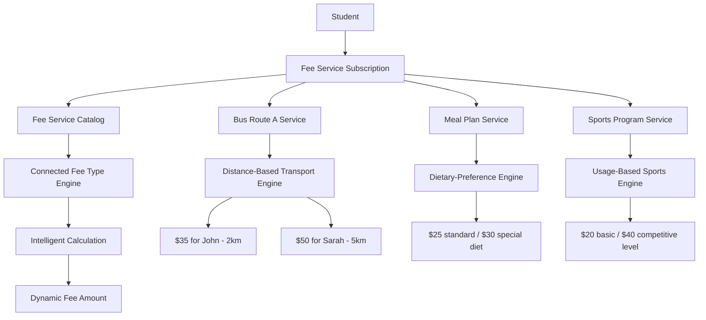

#### **Layer 1: Fee Services (Student-Facing "WHAT")**
- **Purpose**: Define what students can subscribe to
- **Examples**: "Bus Route A Service", "Full Meal Plan", "Advanced Sports Program"
- **Student Experience**: Friendly service names, clear descriptions, subscription management
- **Functionality**: Service catalog, eligibility rules, subscription tracking

#### **Layer 2: Intelligent Fee Types (Calculation "HOW MUCH")**
- **Purpose**: Define how subscribed services are priced
- **Examples**: "Distance-Based Transport Engine", "Performance-Linked Tuition Engine"
- **Calculation Logic**: Mathematical formulas, business rules, AI algorithms, external APIs
- **Flexibility**: One engine can power multiple services, engines can be swapped dynamically

---

## Complete System Architecture & Dataflow
### Comprehensive Workflow with Graph Node IDs

The enhanced fee management system operates through a **9-layer architecture** with **50+ interconnected components**, providing complete traceability and system understanding through unique graph node identifiers.

#### System Overview Diagram

```mermaid
graph TB
    %% User Access Layer
    U1[Admin Dashboard Portal<br/>U1] --> S1[Authentication Gateway<br/>S1]
    U2[Parent Web Portal<br/>U2] --> S1
    U3[Student Mobile App<br/>U3] --> S1
    U4[Staff Desktop Interface<br/>U4] --> S1
    U5[Financial Officer Dashboard<br/>U5] --> S1
    U6[Principal Management Portal<br/>U6] --> S1
    
    %% Security Layer
    S1 --> S2[Role-Based Authorization<br/>S2]
    S2 --> S3[Multi-tenant Isolation<br/>S3]
    S3 --> S4[Data Encryption Layer<br/>S4]
    
    %% Core Process Layer - Configuration
    U1 --> G1[Academic Level Setup<br/>G1]
    U1 --> G2[Fee Service Definition<br/>G2]
    U1 --> G3[Fee Type Engine Config<br/>G3]
    U1 --> G4[Class Fee Group Mapping<br/>G4]
    U1 --> G5[Service Pricing Config<br/>G5]
    
    %% Registration & Service Assignment
    U2 --> G6[Student Registration<br/>G6]
    G6 --> G7[Service Selection Interface<br/>G7]
    G7 --> G8[Automatic Service Determination<br/>G8]
    G8 --> G9[Service Subscription Creation<br/>G9]
    G9 --> G10[Fee Profile Generation<br/>G10]
    
    %% Fee Generation & Calculation
    U1 --> G11[Bulk Fee Generation<br/>G11]
    G11 --> G12[Student Service Lookup<br/>G12]
    G12 --> G13[Fee Calculation Engine<br/>G13]
    G13 --> G14[Individual Adjustment Application<br/>G14]
    G14 --> G15[Fee Record Creation<br/>G15]
    
    %% Payment & Collection
    U2 --> G16[Payment Gateway Interface<br/>G16]
    U3 --> G16
    G16 --> G17[Payment Processing Engine<br/>G17]
    G17 --> G18[Collection Recording<br/>G18]
    G18 --> G19[Receipt Generation<br/>G19]
    G19 --> G20[Notification System<br/>G20]
    
    %% Reporting & Analytics
    U1 --> G21[Due Fees Reporting<br/>G21]
    U5 --> G22[Collection Analytics<br/>G22]
    U6 --> G23[Service Utilization Reports<br/>G23]
    U5 --> G24[Financial Reconciliation<br/>G24]
    
    %% Database Layer
    G1 --> D1[(academic_levels<br/>D1)]
    G2 --> D2[(fee_services<br/>D2)]
    G3 --> D3[(fee_type_engines<br/>D3)]
    G9 --> D4[(student_service_subscriptions<br/>D4)]
    G4 --> D5[(class_fee_group_mappings<br/>D5)]
    G14 --> D6[(individual_student_discounts<br/>D6)]
    G18 --> D7[(fees_collects<br/>D7)]
    S5 --> D8[(audit_logs<br/>D8)]
    
    %% External Integrations
    G17 --> I1[Stripe Payment Gateway<br/>I1]
    G17 --> I2[PayPal Payment Gateway<br/>I2]
    G20 --> I3[Firebase Notifications<br/>I3]
    G20 --> I4[SMS Gateway Twilio<br/>I4]
    G20 --> I5[Email Service<br/>I5]
    S3 --> I6[Multi-tenant Database<br/>I6]
    G11 --> I7[Academic Session Context<br/>I7]
    
    %% Business Rules Layer
    G8 --> B1[Service Eligibility Rules<br/>B1]
    G13 --> B2[Discount Calculation Rules<br/>B2]
    G13 --> B3[Fine Calculation Rules<br/>B3]
    G4 --> B4[Academic Level Rules<br/>B4]
    G17 --> B5[Payment Validation Rules<br/>B5]
    G20 --> B6[Notification Rules<br/>B6]
    
    %% Event System
    G6 --> E1[Student Registration Event<br/>E1]
    G9 --> E2[Service Subscription Change<br/>E2]
    G11 --> E3[Fee Generation Schedule<br/>E3]
    G18 --> E4[Payment Received Event<br/>E4]
    G13 --> E5[Due Date Approaching<br/>E5]
    G13 --> E6[Payment Overdue Event<br/>E6]
    G14 --> E7[Discount Approval Event<br/>E7]
    
    %% Monitoring Layer
    M1[System Performance Monitor<br/>M1] --> G11
    M2[Database Query Optimizer<br/>M2] --> D1
    M2 --> D2
    M2 --> D3
    M2 --> D4
    M2 --> D5
    M2 --> D6
    M2 --> D7
    M3[Cache Management<br/>M3] --> G12
    M4[Load Balancer<br/>M4] --> U1
    M4 --> U2
    M4 --> U3
    M5[Backup & Recovery<br/>M5] --> D7
    M6[Real-time Dashboard<br/>M6] --> U5
    
    %% Innovation Layer (Future)
    N1[AI-Powered Fee Optimization<br/>N1] -.-> G13
    N2[Predictive Analytics<br/>N2] -.-> G22
    N3[ML Discount Engine<br/>N3] -.-> B2
    N4[Blockchain Payment Verification<br/>N4] -.-> G18
    N5[IoT Bus Tracking Integration<br/>N5] -.-> G13
    N6[Mobile Payment QR/NFC<br/>N6] -.-> G16
```

### Layer-by-Layer Architecture Guide

#### 🎯 **User Access Layer (U-Nodes)**
**Purpose**: Multi-stakeholder interface system with role-based access

| Node | Component | Primary Users | Key Functions |
|------|-----------|---------------|---------------|
| **U1** | Admin Dashboard Portal | System Administrators | Service management, fee configuration, bulk operations |
| **U2** | Parent Web Portal | Parents/Guardians | Service subscription, payment processing, fee statements |
| **U3** | Student Mobile App | Students | Fee status, payment history, service requests |
| **U4** | Staff Desktop Interface | School Staff | Cash collection, student profile management |
| **U5** | Financial Officer Dashboard | Finance Team | Revenue analysis, reconciliation, financial reporting |
| **U6** | Principal Management Portal | School Leadership | Strategic analytics, approval workflows, policy management |

#### 🔒 **Security Layer (S-Nodes)**
**Purpose**: Comprehensive security, compliance, and data protection

| Node | Component | Function | Integration |
|------|-----------|----------|-------------|
| **S1** | Authentication Gateway | Single sign-on, MFA, session management | All user interfaces |
| **S2** | Role-Based Authorization | Permission matrix, feature access control | Every system function |
| **S3** | Multi-tenant Isolation | SaaS data separation, school-specific contexts | Database and cache layers |
| **S4** | Data Encryption Layer | PCI compliance, sensitive data protection | Payment and personal data |
| **S5** | Audit Trail System | Complete action logging, compliance reporting | All data modifications |
| **S6** | Session Management | Timeout control, concurrent access limits | Active user sessions |

#### ⚙️ **Core Process Layer (G-Nodes)**
**Purpose**: Main business logic and workflow orchestration

##### **Configuration Processes (G1-G5)**
| Node | Process | Responsibility | Output |
|------|---------|----------------|--------|
| **G1** | Academic Level Setup | Define school grade structure (Primary, Secondary, Advanced) | Academic level definitions |
| **G2** | Fee Service Definition | Create student-facing services (Bus, Meals, Sports) | Service catalog |
| **G3** | Fee Type Engine Config | Configure intelligent calculation engines | Pricing logic |
| **G4** | Class Fee Group Mapping | Link classes to appropriate fee structures | Automatic fee group selection |
| **G5** | Service Pricing Config | Set base rates and pricing rules per service | Service pricing matrix |

##### **Registration & Assignment (G6-G10)**
| Node | Process | Trigger | Outcome |
|------|---------|---------|---------|
| **G6** | Student Registration | New student enrollment | Student profile creation |
| **G7** | Service Selection Interface | Registration workflow | Parent/student service choices |
| **G8** | Automatic Service Determination | Academic level + required services | Mandatory service assignment |
| **G9** | Service Subscription Creation | Service selection completion | Active service subscriptions |
| **G10** | Fee Profile Generation | Service subscriptions finalized | Student-specific fee profile |

##### **Fee Generation & Calculation (G11-G15)**
| Node | Process | Input | Processing Logic |
|------|---------|--------|------------------|
| **G11** | Bulk Fee Generation | Monthly/quarterly schedule trigger | Batch processing initiation |
| **G12** | Student Service Lookup | Individual student profiles | Active service subscription retrieval |
| **G13** | Fee Calculation Engine | Services + pricing engines + discounts | Intelligent fee computation |
| **G14** | Individual Adjustment Application | Special discounts + overrides | Personalized fee modifications |
| **G15** | Fee Record Creation | Final calculated amounts | Billable fee records |

##### **Payment & Collection (G16-G20)**
| Node | Process | Channel | Integration |
|------|---------|---------|-------------|
| **G16** | Payment Gateway Interface | Online payments (Stripe/PayPal) | External payment processors |
| **G17** | Payment Processing Engine | All payment methods | Transaction validation & recording |
| **G18** | Collection Recording | Successful payments | Database update + reconciliation |
| **G19** | Receipt Generation | Payment confirmation | PDF receipts + digital records |
| **G20** | Notification System | Payment events | Multi-channel alerts (SMS/Email/Push) |

##### **Reporting & Analytics (G21-G24)**
| Node | Process | Data Source | Report Type |
|------|---------|-------------|-------------|
| **G21** | Due Fees Reporting | Unpaid fee records | Outstanding payments by student/class |
| **G22** | Collection Analytics | Payment history + trends | Revenue analysis & forecasting |
| **G23** | Service Utilization Reports | Service subscriptions + usage | Service popularity & optimization |
| **G24** | Financial Reconciliation | Complete transaction history | Accounting & audit reports |

#### 💾 **Database Layer (D-Nodes)**
**Purpose**: Persistent data storage with optimized schemas

| Node | Table | Purpose | Key Relationships |
|------|--------|---------|------------------|
| **D1** | `academic_levels` | Grade structure definition | Classes, fee groups |
| **D2** | `fee_services` | Student-facing service catalog | Service subscriptions, pricing |
| **D3** | `fee_type_engines` | Intelligent calculation engines | Services, pricing logic |
| **D4** | `student_service_subscriptions` | Individual service assignments | Students, services, billing |
| **D5** | `class_fee_group_mappings` | Automatic fee group assignment | Classes, fee groups |
| **D6** | `individual_student_discounts` | Personal discount overrides | Students, approval workflows |
| **D7** | `fees_collects` | Payment transaction records | Students, fee assignments |
| **D8** | `audit_logs` | Complete system activity trail | All entities, compliance |

#### 🔗 **Integration Layer (I-Nodes)**
**Purpose**: External system connectivity and data exchange

| Node | Integration | Purpose | Data Exchange |
|------|-------------|---------|---------------|
| **I1** | Stripe Payment Gateway | Credit card processing | Payment tokens, transaction status |
| **I2** | PayPal Payment Gateway | Alternative payment method | Payment confirmation, refunds |
| **I3** | Firebase Notifications | Real-time push notifications | Payment alerts, due date reminders |
| **I4** | SMS Gateway (Twilio) | Text message notifications | Payment confirmations, overdue notices |
| **I5** | Email Service | Email communications | Receipts, statements, notifications |
| **I6** | Multi-tenant Database | SaaS data isolation | School-specific data context |
| **I7** | Academic Session Context | School calendar integration | Term dates, academic periods |

#### 📋 **Business Rules Layer (B-Nodes)**
**Purpose**: Automated policy enforcement and calculation logic

| Node | Rule Engine | Function | Business Logic |
|------|-------------|----------|----------------|
| **B1** | Service Eligibility Rules | Who can subscribe to what services | Academic level + service restrictions |
| **B2** | Discount Calculation Rules | Automatic discount application | Sibling discounts, early payment incentives |
| **B3** | Fine Calculation Rules | Late payment penalty computation | Percentage vs fixed fines, grace periods |
| **B4** | Academic Level Rules | Fee group restrictions by grade | Prevent wrong fee assignments |
| **B5** | Payment Validation Rules | Transaction limits and validation | Amount limits, payment method restrictions |
| **B6** | Notification Rules | When and how to send alerts | Due date reminders, payment confirmations |

#### ⚡ **Event System (E-Nodes)**
**Purpose**: Real-time system reactions and workflow triggers

| Node | Event | Trigger | System Response |
|------|--------|---------|-----------------|
| **E1** | Student Registration Event | New student enrollment | Auto-create service profiles |
| **E2** | Service Subscription Change | Service add/remove/modify | Update fee calculations |
| **E3** | Fee Generation Schedule | Monthly/quarterly schedule | Bulk fee processing |
| **E4** | Payment Received Event | Successful payment processing | Update balances, send receipts |
| **E5** | Due Date Approaching | 3-7 days before due date | Send reminder notifications |
| **E6** | Payment Overdue Event | Payment past due date | Apply fines, send overdue notices |
| **E7** | Discount Approval Event | Manual discount approval | Apply discount, notify stakeholders |

#### 📊 **Monitoring Layer (M-Nodes)**
**Purpose**: System performance, reliability, and operational intelligence

| Node | Monitor | Function | Metrics |
|------|---------|----------|---------|
| **M1** | System Performance Monitor | Track processing times | Fee generation speed, response times |
| **M2** | Database Query Optimizer | Optimize database performance | Query execution times, index usage |
| **M3** | Cache Management | Improve response times | Cache hit rates, data freshness |
| **M4** | Load Balancer | Distribute user traffic | Server load, response distribution |
| **M5** | Backup & Recovery | Data protection | Backup success, recovery time |
| **M6** | Real-time Dashboard | Live system metrics | Active users, transaction volume |

#### 🚀 **Innovation Layer (N-Nodes) - Future Enhancements**
**Purpose**: Advanced features and emerging technology integration

| Node | Innovation | Capability | Potential Impact |
|------|------------|------------|------------------|
| **N1** | AI-Powered Fee Optimization | Dynamic pricing based on patterns | Optimized revenue, fair pricing |
| **N2** | Predictive Analytics Engine | Payment behavior prediction | Reduce defaults, improve collection |
| **N3** | ML Discount Engine | Personalized discount recommendations | Improved retention, targeted incentives |
| **N4** | Blockchain Payment Verification | Immutable payment records | Enhanced security, audit compliance |
| **N5** | IoT Bus Tracking Integration | Real-time transport fee adjustments | Usage-based transport pricing |
| **N6** | Mobile Payment QR/NFC | Contactless payment options | Improved payment convenience |

---

## System Access Patterns & Workflow Connections

### 🔄 Primary Workflow Patterns

#### **Workflow 1: Admin System Configuration**
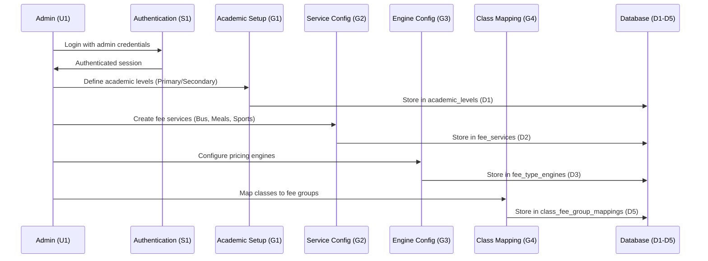

#### **Workflow 2: Student Registration & Service Assignment**
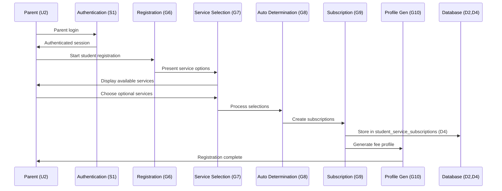

#### **Workflow 3: Monthly Fee Generation Process**
```mermaid
sequenceDiagram
    participant Admin as Admin (U1)
    participant Bulk as Bulk Generation (G11)
    participant Lookup as Service Lookup (G12)
    participant Calc as Fee Calculation (G13)
    participant Adjust as Adjustments (G14)
    participant Create as Fee Creation (G15)
    participant DB as Database (D4,D6,D7)
    participant Event as Event System (E3)
    
    Admin->>Bulk: Trigger monthly fee generation
    Bulk->>Event: Fire fee generation event (E3)
    Event->>Lookup: Lookup student services
    Lookup->>DB: Query student_service_subscriptions (D4)
    DB->>Calc: Return active subscriptions
    Calc->>DB: Get individual discounts (D6)
    Calc->>Adjust: Apply adjustments
    Adjust->>Create: Create fee records
    Create->>DB: Store in fees_collects (D7)
    Create->>Admin: Generation complete
```

#### **Workflow 4: Payment Processing Flow**
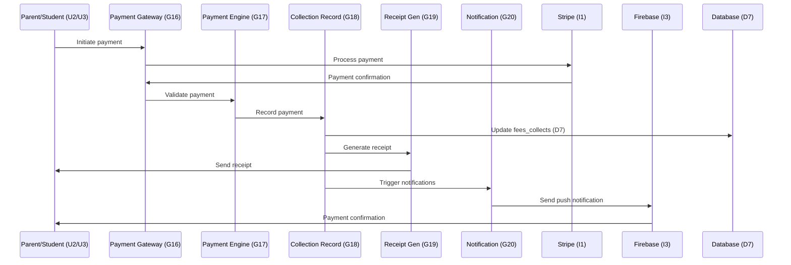

### 🎯 User Access Matrix

#### **Access Control by User Type**
| User Type | Graph Nodes | Primary Functions | Access Level |
|-----------|-------------|-------------------|--------------|
| **System Admin (U1)** | G1-G5, G11, G21, G24 | Configuration, bulk operations, reporting | Full system access |
| **Parent (U2)** | G6-G7, G16-G17, Limited reporting | Registration, payments, service management | Own children only |
| **Student (U3)** | G16, Limited reporting | Payment status, fee history | Own records only |
| **School Staff (U4)** | G17-G18, G21, Student management | Cash collection, student profiles | Class/section level |
| **Finance Officer (U5)** | G22, G24, All reporting nodes | Financial analysis, reconciliation | School-wide financial data |
| **Principal (U6)** | G23, G14 approval, Analytics | Strategic oversight, approval workflows | School-wide read access |

#### **Role-Based Feature Access**
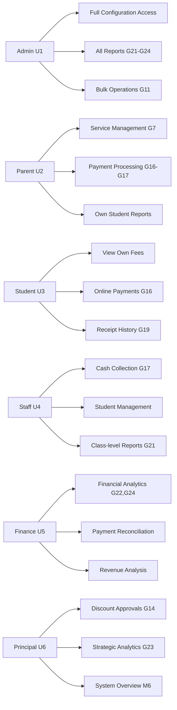

### 🔗 Integration Flow Patterns

#### **Payment Gateway Integration**
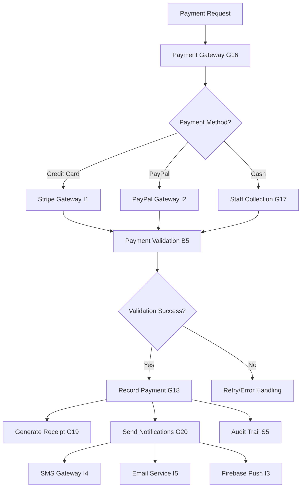

#### **Multi-tenant Data Flow**
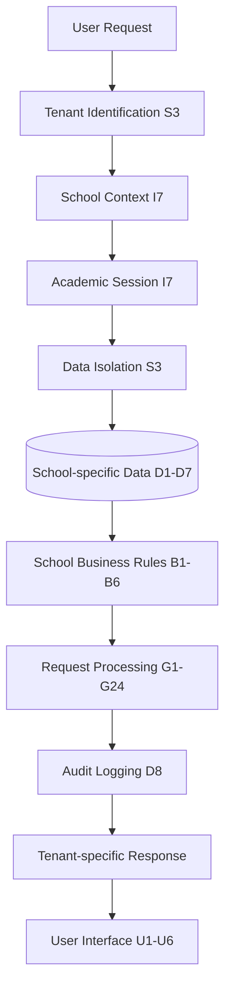

#### **Event-Driven Workflow Automation**
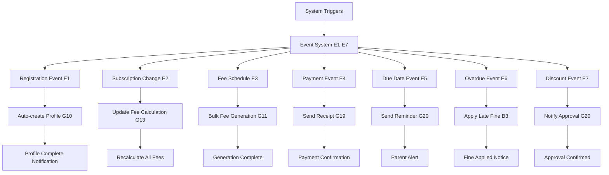

### 📊 Performance & Monitoring Flows

#### **System Performance Monitoring**
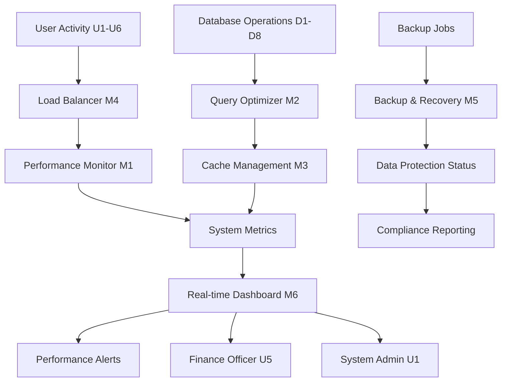

### 🔄 Data Synchronization Patterns

#### **Real-time Data Sync Across Components**
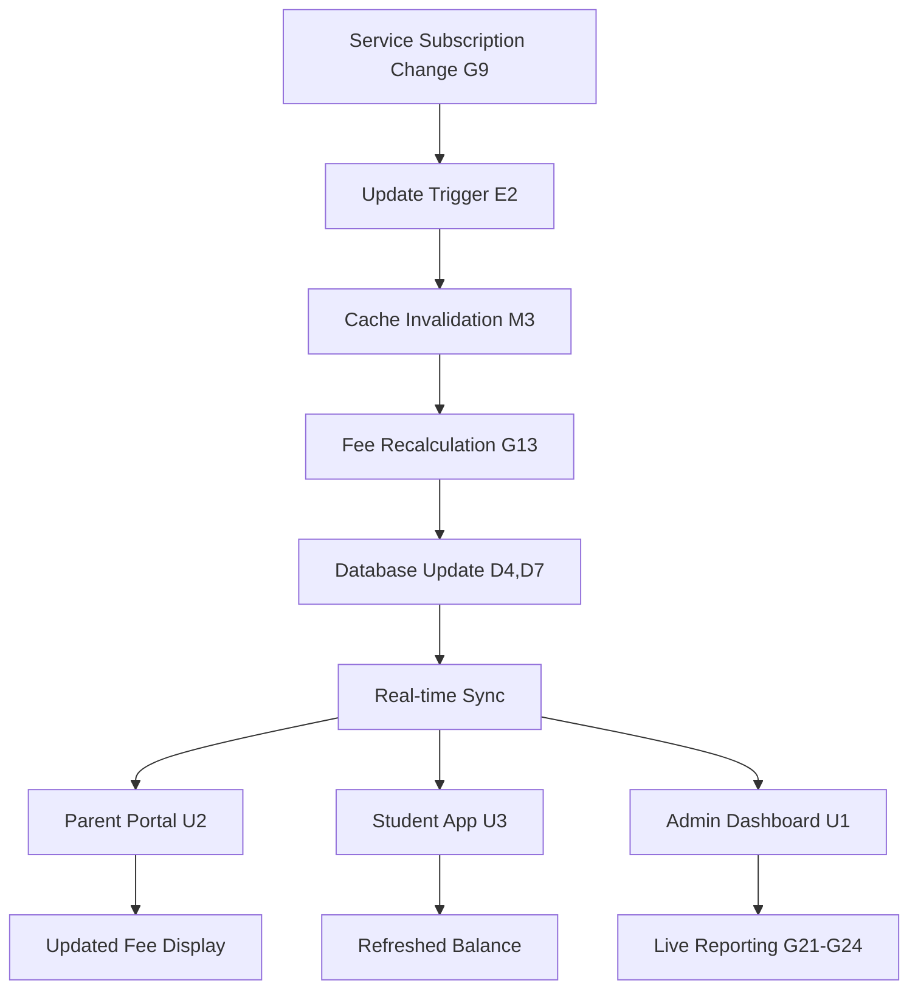

### 🎛️ Configuration Management Flow

#### **Dynamic Configuration Updates**
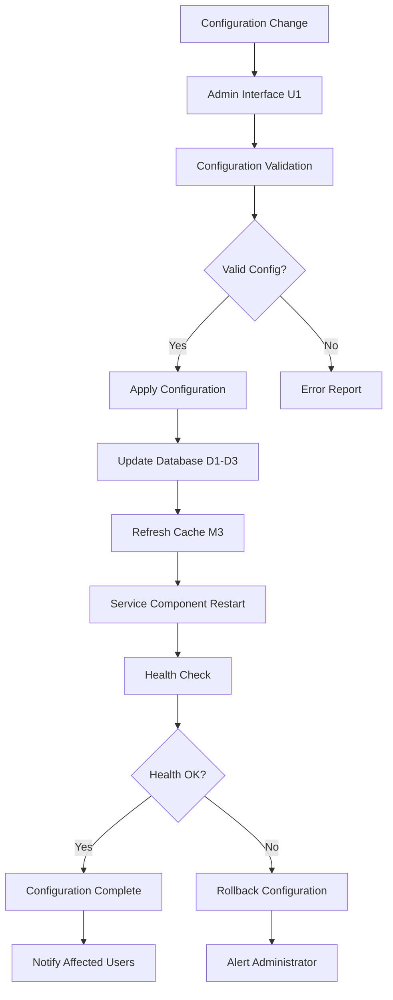

---

## 📖 Graph ID Reference System
### Complete Node Directory & Navigation Guide

This comprehensive reference system provides quick lookup for all **50+ system components** with their unique graph node identifiers, enabling efficient navigation and system understanding.

### 🎯 **User Interface Nodes (U1-U6)**

| Node ID | Component Name | User Type | Primary Access URL Pattern | Key Features |
|---------|----------------|-----------|----------------------------|--------------|
| **U1** | Admin Dashboard Portal | System Administrator | `/admin/dashboard` | Service config, bulk operations, system reports |
| **U2** | Parent Web Portal | Parents/Guardians | `/parent/portal` | Service subscription, payments, student fees |
| **U3** | Student Mobile App | Students | Mobile app + `/student/app` | Fee status, payment history, receipts |
| **U4** | Staff Desktop Interface | School Staff | `/staff/console` | Cash collection, student management |
| **U5** | Financial Officer Dashboard | Finance Team | `/finance/dashboard` | Revenue analytics, reconciliation |
| **U6** | Principal Management Portal | School Leadership | `/principal/overview` | Strategic analytics, approvals |

### 🔒 **Security & Compliance Nodes (S1-S6)**

| Node ID | Security Component | Function | Implementation |
|---------|-------------------|----------|----------------|
| **S1** | Authentication Gateway | Single sign-on, MFA | JWT tokens, OAuth 2.0 |
| **S2** | Role-Based Authorization | Permission matrix | RBAC middleware, policy engine |
| **S3** | Multi-tenant Isolation | SaaS data separation | Tenant context, scoped queries |
| **S4** | Data Encryption Layer | PCI compliance | AES-256, encrypted fields |
| **S5** | Audit Trail System | Complete action logging | Event sourcing, compliance logs |
| **S6** | Session Management | Timeout, concurrent limits | Redis sessions, WebSocket tracking |

### ⚙️ **Core Business Process Nodes (G1-G24)**

#### Configuration Processes (G1-G5)
| Node ID | Process Name | Responsibility | Database Impact |
|---------|--------------|----------------|-----------------|
| **G1** | Academic Level Setup | Define grade structure | Updates `academic_levels` (D1) |
| **G2** | Fee Service Definition | Create service catalog | Updates `fee_services` (D2) |
| **G3** | Fee Type Engine Config | Configure pricing logic | Updates `fee_type_engines` (D3) |
| **G4** | Class Fee Group Mapping | Auto-assign fee groups | Updates `class_fee_group_mappings` (D5) |
| **G5** | Service Pricing Config | Set service rates | Updates multiple pricing tables |

#### Registration & Assignment (G6-G10)
| Node ID | Process Name | Trigger Event | Data Created |
|---------|--------------|---------------|--------------|
| **G6** | Student Registration | New enrollment | Student profile + base data |
| **G7** | Service Selection Interface | Parent registration flow | Service selection preferences |
| **G8** | Automatic Service Determination | Academic level assignment | Mandatory service assignments |
| **G9** | Service Subscription Creation | Selection completion | Active subscriptions in (D4) |
| **G10** | Fee Profile Generation | Subscription finalization | Complete student fee profile |

#### Fee Generation & Calculation (G11-G15)
| Node ID | Process Name | Processing Type | Output |
|---------|--------------|-----------------|--------|
| **G11** | Bulk Fee Generation | Scheduled batch processing | Fee generation jobs |
| **G12** | Student Service Lookup | Individual profile queries | Active service lists |
| **G13** | Fee Calculation Engine | Intelligent computation | Calculated fee amounts |
| **G14** | Individual Adjustment Application | Personalized modifications | Adjusted fee amounts |
| **G15** | Fee Record Creation | Billable record generation | Fee collection records (D7) |

#### Payment & Collection (G16-G20)
| Node ID | Process Name | Integration | Transaction Flow |
|---------|--------------|-------------|------------------|
| **G16** | Payment Gateway Interface | Stripe (I1), PayPal (I2) | Payment initiation |
| **G17** | Payment Processing Engine | All payment methods | Transaction validation |
| **G18** | Collection Recording | Database updates | Payment confirmation |
| **G19** | Receipt Generation | PDF generation | Receipt delivery |
| **G20** | Notification System | Multi-channel alerts | Notification dispatch |

#### Reporting & Analytics (G21-G24)
| Node ID | Report Type | Data Sources | Target Users |
|---------|-------------|--------------|--------------|
| **G21** | Due Fees Reporting | Unpaid records (D7) | Admin (U1), Staff (U4) |
| **G22** | Collection Analytics | Payment history | Finance Officer (U5) |
| **G23** | Service Utilization Reports | Subscription data (D4) | Principal (U6) |
| **G24** | Financial Reconciliation | Complete transaction history | Finance Officer (U5) |

### 💾 **Database Layer Nodes (D1-D8)**

| Node ID | Table Name | Purpose | Key Relationships |
|---------|------------|---------|-------------------|
| **D1** | `academic_levels` | Grade structure definition | → Classes → Fee Groups |
| **D2** | `fee_services` | Service catalog | → Subscriptions → Pricing |
| **D3** | `fee_type_engines` | Calculation engines | → Services → Logic |
| **D4** | `student_service_subscriptions` | Individual assignments | Student ↔ Service ↔ Billing |
| **D5** | `class_fee_group_mappings` | Auto fee group assignment | Class → Fee Group |
| **D6** | `individual_student_discounts` | Personal overrides | Student → Discount Rules |
| **D7** | `fees_collects` | Payment records | Student → Payment → Receipt |
| **D8** | `audit_logs` | System activity trail | All Entities → Compliance |

### 🔗 **External Integration Nodes (I1-I7)**

| Node ID | Integration | Protocol | Data Exchange |
|---------|-------------|----------|---------------|
| **I1** | Stripe Payment Gateway | REST API + Webhooks | Payment tokens ↔ Transaction status |
| **I2** | PayPal Payment Gateway | REST API + IPN | Payment confirmation ↔ Refunds |
| **I3** | Firebase Notifications | FCM Protocol | Push notifications ↔ Device tokens |
| **I4** | SMS Gateway (Twilio) | REST API | SMS delivery ↔ Status reports |
| **I5** | Email Service | SMTP + REST | Email delivery ↔ Read receipts |
| **I6** | Multi-tenant Database | Database sharding | Tenant isolation ↔ Context switching |
| **I7** | Academic Session Context | Internal API | Session data ↔ Calendar integration |

### 📋 **Business Rules Engine Nodes (B1-B6)**

| Node ID | Rule Engine | Business Logic | Enforcement Points |
|---------|-------------|----------------|-------------------|
| **B1** | Service Eligibility Rules | Academic level + service restrictions | G8, G9 (Service assignment) |
| **B2** | Discount Calculation Rules | Sibling + early payment logic | G13, G14 (Fee calculation) |
| **B3** | Fine Calculation Rules | Late payment penalties | G13, G15 (Collection) |
| **B4** | Academic Level Rules | Fee group restrictions | G4, G13 (Group assignment) |
| **B5** | Payment Validation Rules | Transaction limits + methods | G17 (Payment processing) |
| **B6** | Notification Rules | Alert triggers + channels | G20 (Notification system) |

### ⚡ **Event System Nodes (E1-E7)**

| Node ID | Event Type | Trigger Conditions | System Response |
|---------|------------|-------------------|-----------------|
| **E1** | Student Registration Event | New enrollment completion | Auto-create service profiles (G10) |
| **E2** | Service Subscription Change | Service add/remove/modify | Update fee calculations (G13) |
| **E3** | Fee Generation Schedule | Monthly/quarterly schedule | Bulk processing trigger (G11) |
| **E4** | Payment Received Event | Successful payment | Update balances + receipts (G18, G19) |
| **E5** | Due Date Approaching | 3-7 days before due date | Send reminders (G20) |
| **E6** | Payment Overdue Event | Payment past due date | Apply fines + notices (B3, G20) |
| **E7** | Discount Approval Event | Manual discount approval | Apply discount + notify (G14, G20) |

### 📊 **Monitoring & Performance Nodes (M1-M6)**

| Node ID | Monitor Type | Metrics Tracked | Alert Conditions |
|---------|--------------|-----------------|------------------|
| **M1** | System Performance Monitor | Response times, throughput | >3s response time |
| **M2** | Database Query Optimizer | Query performance, indexes | >1s query execution |
| **M3** | Cache Management | Hit rates, data freshness | <80% cache hit rate |
| **M4** | Load Balancer | Server distribution, health | Server failure detected |
| **M5** | Backup & Recovery | Backup success, recovery time | Backup failure, >RTO |
| **M6** | Real-time Dashboard | Live metrics, user activity | System threshold breach |

### 🚀 **Innovation Layer Nodes (N1-N6) - Future Roadmap**

| Node ID | Innovation | Technology Stack | Implementation Timeline |
|---------|------------|------------------|----------------------|
| **N1** | AI-Powered Fee Optimization | TensorFlow, Python ML | Phase 4 (12+ months) |
| **N2** | Predictive Analytics Engine | Apache Spark, Data Lake | Phase 4 (12+ months) |
| **N3** | ML Discount Engine | Scikit-learn, AutoML | Phase 5 (18+ months) |
| **N4** | Blockchain Payment Verification | Ethereum, Smart Contracts | Phase 5 (18+ months) |
| **N5** | IoT Bus Tracking Integration | MQTT, GPS tracking | Phase 6 (24+ months) |
| **N6** | Mobile Payment QR/NFC | NFC SDK, QR generation | Phase 4 (12+ months) |

### 🔍 **Quick Navigation Matrix**

#### **By User Role**
- **Admin Tasks**: U1 → G1-G5, G11, G21, G24 → D1-D8
- **Parent Actions**: U2 → G6-G7, G16-G17 → D4, D7
- **Student Access**: U3 → G16, Limited G21 → D7
- **Staff Operations**: U4 → G17-G18, G21 → D7
- **Finance Analysis**: U5 → G22, G24, M6 → D7, D8
- **Leadership Overview**: U6 → G14, G23, M6 → All reporting

#### **By Process Flow**
- **Setup Flow**: G1 → G2 → G3 → G4 → G5
- **Registration Flow**: G6 → G7 → G8 → G9 → G10
- **Fee Generation Flow**: G11 → G12 → G13 → G14 → G15
- **Payment Flow**: G16 → G17 → G18 → G19 → G20
- **Reporting Flow**: G21/G22/G23/G24 ← D7 ← D8

#### **By Data Flow**
- **Configuration Data**: D1 ← G1, D2 ← G2, D3 ← G3
- **Service Data**: D4 ← G9, D5 ← G4
- **Financial Data**: D6 ← G14, D7 ← G18
- **Audit Data**: D8 ← S5 (all operations)

#### **By Integration Points**
- **Payment Integrations**: I1, I2 ← G16, G17
- **Communication Integrations**: I3, I4, I5 ← G20
- **System Integrations**: I6 ← S3, I7 ← G11

### 📋 **Node Relationship Legend**

| Symbol | Meaning | Example |
|--------|---------|---------|
| `→` | Direct flow/triggers | G11 → G12 (Bulk generation triggers lookup) |
| `←` | Data source/input | D7 ← G18 (Payment data flows to collection) |
| `↔` | Bidirectional exchange | Student ↔ Service (Many-to-many relationship) |
| `-.->` | Future/planned connection | N1 -.-> G13 (Future AI integration) |

This reference system provides complete traceability across the **9-layer, 50+ component architecture**, enabling stakeholders to quickly understand system relationships, navigate between components, and identify integration points for maintenance, troubleshooting, and future enhancements.

---

## 🎯 Simplified Admin Panel Workflow
### Essential Fee Management Demonstration

This simplified diagram shows the **core admin workflow** for managing fees, creating services, and generating student fees.

#### **Admin Panel Fee Management Flow**

```mermaid
    graph TB
    %% Admin Entry Point
    Admin[👤 Admin Login<br/>U1] --> Dashboard[📊 Admin Dashboard<br/>Fee Management Section]
    
    %% Step 1: Setup Fee Services
    Dashboard --> Services[🏷️ Fee Services Management<br/>G2]
    Services --> CreateService[➕ Create New Service]
    CreateService --> ServiceTypes{Service Type?}
    
    ServiceTypes -->|Required| Tuition[📚 Tuition Fee<br/>$500/month]
    ServiceTypes -->|Optional| Bus[🚌 Bus Service<br/>$100/month]
    ServiceTypes -->|Optional| Meals[🍽️ Meal Plan<br/>$80/month]
    ServiceTypes -->|Optional| Sports[⚽ Sports Program<br/>$50/month]
    
    %% Step 2: Class Configuration
    Dashboard --> ClassConfig[🏫 Class Configuration<br/>G4]
    ClassConfig --> MapClasses[📍 Map Classes to Fee Groups]
    MapClasses --> ClassMapping[Grade 1-5: Primary Fees<br/>Grade 6-10: Secondary Fees<br/>Grade 11-12: Advanced Fees]
    
    %% Step 3: Student Service Assignment
    Dashboard --> StudentAssign[👨‍🎓 Student Management<br/>G7-G9]
    StudentAssign --> SelectStudents[Select Students]
    SelectStudents --> ChooseServices[Choose Services for Students]
    
    ChooseServices --> Student1[Student A: Tuition + Bus]
    ChooseServices --> Student2[Student B: Tuition Only]
    ChooseServices --> Student3[Student C: Tuition + Bus + Meals]
    
    %% Step 4: Fee Generation
    Dashboard --> FeeGen[💰 Fee Generation<br/>G11]
    FeeGen --> SelectMonth[Select Month/Quarter]
    SelectMonth --> Preview[👁️ Preview Fees<br/>G12-G13]
    
    Preview --> PreviewDetails[📋 Preview Shows:<br/>• Student A: $600 (Tuition + Bus)<br/>• Student B: $500 (Tuition)<br/>• Student C: $680 (All Services)]
    
    PreviewDetails --> Confirm{Confirm Generation?}
    Confirm -->|Yes| Generate[⚡ Generate Fees<br/>G15]
    Confirm -->|No| Modify[🔄 Modify Services]
    
    %% Step 5: Individual Adjustments
    Dashboard --> Discounts[🎯 Individual Adjustments<br/>G14]
    Discounts --> AddDiscount[➕ Add Student Discount]
    AddDiscount --> DiscountType{Discount Type?}
    
    DiscountType -->|Sibling| Sibling[👨‍👩‍👧‍👦 10% Sibling Discount]
    DiscountType -->|Financial| Financial[💰 $100 Financial Aid]
    DiscountType -->|Merit| Merit[🏆 25% Merit Scholarship]
    
    %% Step 6: Reports & Monitoring
    Dashboard --> Reports[📊 Reports & Analytics<br/>G21-G24]
    Reports --> ReportTypes{Report Type?}
    
    ReportTypes -->|Due Fees| DueReport[📋 Students with Due Fees]
    ReportTypes -->|Collections| CollectionReport[💳 Payment Collections]
    ReportTypes -->|Services| ServiceReport[🎯 Service Utilization]
    
    %% Database Storage (Simplified)
    Generate --> Database[(💾 Database Storage<br/>D4: Subscriptions<br/>D7: Fee Records)]
    Sibling --> Database
    Financial --> Database
    Merit --> Database
    
    %% Styling
    classDef admin fill:#e1f5fe,stroke:#0277bd,stroke-width:2px
    classDef process fill:#f3e5f5,stroke:#7b1fa2,stroke-width:2px
    classDef service fill:#e8f5e8,stroke:#388e3c,stroke-width:2px
    classDef student fill:#fff3e0,stroke:#f57c00,stroke-width:2px
    classDef database fill:#fce4ec,stroke:#c2185b,stroke-width:2px
    
    class Admin,Dashboard admin
    class Services,ClassConfig,StudentAssign,FeeGen,Discounts,Reports process
    class Tuition,Bus,Meals,Sports service
    class Student1,Student2,Student3 student
    class Database database
```

### 📋 **Admin Panel Key Features**

#### **1. Fee Services Management (G2)**
```
📍 Navigation: Admin Dashboard → Fee Services
🎯 Purpose: Create and manage available services

Available Actions:
✅ Create New Service (Tuition, Bus, Meals, Sports)
✅ Set Base Pricing ($500 tuition, $100 bus)  
✅ Define Service Categories (Required vs Optional)
✅ Configure Academic Level Restrictions
```

#### **2. Student Service Assignment (G7-G9)**
```
📍 Navigation: Admin Dashboard → Student Management
🎯 Purpose: Assign services to individual students

Workflow:
1️⃣ Select Students (Individual or Bulk)
2️⃣ Choose Services per Student
3️⃣ Automatic Profile Creation
4️⃣ Service Subscription Storage

Result: Each student has unique service combination
```

#### **3. Fee Generation Process (G11-G15)**
```
📍 Navigation: Admin Dashboard → Generate Fees
🎯 Purpose: Create monthly/quarterly student fees

Process Flow:
1️⃣ Select Time Period (Month/Quarter)
2️⃣ Auto-Lookup Student Services (G12)
3️⃣ Calculate Individual Fees (G13)
4️⃣ Show Preview with Breakdown
5️⃣ Generate Final Fee Records (G15)

Example Output:
• Student A (Tuition + Bus): $600
• Student B (Tuition Only): $500  
• Student C (All Services): $680
```

#### **4. Individual Adjustments (G14)**
```
📍 Navigation: Admin Dashboard → Student Adjustments
🎯 Purpose: Apply individual discounts and overrides

Discount Types:
🔹 Percentage Discount (10% sibling discount)
🔹 Fixed Amount Discount ($100 financial aid)  
🔹 Merit Scholarships (25% off all fees)
🔹 Complete Fee Override (Staff children: $0)

Workflow:
1️⃣ Select Student
2️⃣ Choose Discount Type & Amount
3️⃣ Add Justification/Notes
4️⃣ Apply to Current/Future Fees
```

### 🎛️ **Admin Dashboard Interface Layout**

```
┌─────────────────────────────────────────────────────────────────┐
│                     📊 Fee Management Dashboard                 │
├─────────────────────────────────────────────────────────────────┤
│                                                                 │
│  🏷️ Fee Services        🏫 Class Config       👨‍🎓 Students        │
│  ┌─────────────────┐   ┌─────────────────┐   ┌─────────────────┐ │
│  │ • Create Service│   │ • Map Classes   │   │ • Assign Services│ │
│  │ • Set Pricing   │   │ • Fee Groups    │   │ • Bulk Actions  │ │
│  │ • Categories    │   │ • Academic Lvl  │   │ • Individual    │ │
│  └─────────────────┘   └─────────────────┘   └─────────────────┘ │
│                                                                 │
│  💰 Fee Generation      🎯 Adjustments        📊 Reports         │
│  ┌─────────────────┐   ┌─────────────────┐   ┌─────────────────┐ │
│  │ • Monthly Fees  │   │ • Discounts     │   │ • Due Fees      │ │
│  │ • Preview Mode  │   │ • Scholarships  │   │ • Collections   │ │
│  │ • Bulk Generate │   │ • Overrides     │   │ • Service Usage │ │
│  └─────────────────┘   └─────────────────┘   └─────────────────┘ │
└─────────────────────────────────────────────────────────────────┘
```

### ⚡ **Quick Admin Actions**

| Action | Graph Node | Purpose | Result |
|--------|------------|---------|---------|
| **Create Bus Service** | G2 | Add new optional service | Students can subscribe to bus transport |
| **Assign Services to Class 1A** | G7-G9 | Bulk service assignment | All Class 1A students get selected services |
| **Generate March Fees** | G11-G15 | Monthly fee creation | Individual fee records created per student |
| **Apply Sibling Discount** | G14 | Individual adjustment | 10% discount applied to all sibling students |
| **View Due Fees Report** | G21 | Check outstanding payments | List of students with unpaid fees |

### 🔄 **Typical Admin Workflow**

```
1. Setup Phase (Start of Academic Year)
   📝 Create Fee Services → Map Classes → Set Pricing

2. Student Enrollment  
   👨‍🎓 Assign Services → Create Profiles → Verify Setup

3. Monthly Operations
   💰 Generate Fees → Review Preview → Confirm Generation
   
4. Ongoing Management
   🎯 Apply Discounts → Monitor Collections → Generate Reports
```

This simplified view focuses on the **essential admin functions** for demonstrating fee management capabilities while maintaining the powerful flexibility of the enhanced system.

### Integration Database Schema

#### **Enhanced Fee Services Table**
```sql
CREATE TABLE fee_services (
    id BIGINT PRIMARY KEY AUTO_INCREMENT,
    name VARCHAR(255) NOT NULL, -- "Bus Route A Service"
    display_name VARCHAR(255), -- "School Bus Transportation - Route A"
    description TEXT,
    category ENUM('transport', 'academic', 'meals', 'activities', 'materials'),
    
    -- Connection to intelligent calculation
    fee_type_engine_id BIGINT NOT NULL, -- Links to calculation engine
    default_parameters JSON, -- Service-specific calculation parameters
    
    -- Service configuration
    is_optional BOOLEAN DEFAULT true,
    requires_subscription BOOLEAN DEFAULT true,
    academic_level_id BIGINT NULL, -- Restrict to specific academic levels
    
    -- Subscription rules
    subscription_start_date DATE NULL,
    subscription_end_date DATE NULL,
    max_subscribers INT NULL, -- Capacity limits
    
    status TINYINT DEFAULT 1,
    created_at TIMESTAMP DEFAULT CURRENT_TIMESTAMP,
    updated_at TIMESTAMP DEFAULT CURRENT_TIMESTAMP ON UPDATE CURRENT_TIMESTAMP,
    
    INDEX idx_category (category),
    INDEX idx_status (status),
    FOREIGN KEY (fee_type_engine_id) REFERENCES fee_type_engines(id),
    FOREIGN KEY (academic_level_id) REFERENCES academic_levels(id)
);
```

#### **Fee Type Engines Table** 
```sql
CREATE TABLE fee_type_engines (
    id BIGINT PRIMARY KEY AUTO_INCREMENT,
    name VARCHAR(255) NOT NULL, -- "distance_based_transport_fee"
    display_name VARCHAR(255), -- "Distance-Based Transport Fee Calculator"
    description TEXT,
    
    -- Engine type and configuration
    engine_type ENUM(
        'fixed_amount',     -- Simple fixed fee (backward compatibility)
        'mathematical',     -- Formula-based calculations
        'rule_based',       -- Conditional logic
        'usage_based',      -- Based on consumption/usage
        'performance_based',-- Based on student performance
        'ml_powered',       -- Machine learning algorithms
        'api_integrated',   -- External data sources
        'blockchain_verified' -- Immutable calculations
    ) NOT NULL,
    
    -- Calculation configuration
    calculation_config JSON, -- Engine-specific logic and parameters
    variable_definitions JSON, -- Required input variables
    validation_rules JSON, -- Input validation rules
    business_rules JSON, -- Conditional business logic
    
    -- Metadata
    version VARCHAR(50),
    is_active BOOLEAN DEFAULT true,
    requires_approval BOOLEAN DEFAULT false,
    
    created_at TIMESTAMP DEFAULT CURRENT_TIMESTAMP,
    updated_at TIMESTAMP DEFAULT CURRENT_TIMESTAMP ON UPDATE CURRENT_TIMESTAMP,
    
    INDEX idx_engine_type (engine_type),
    INDEX idx_active (is_active)
);
```

#### **Service-Engine Connection Examples**
```sql
-- Sample Fee Services with Connected Engines
INSERT INTO fee_services (name, display_name, category, fee_type_engine_id, default_parameters) VALUES
('bus_route_a', 'Bus Transportation - Route A', 'transport', 1, '{"route_id": "A", "pickup_points": ["Main St", "Oak Ave"]}'),
('full_meal_plan', 'Complete Meal Plan', 'meals', 2, '{"meals_per_day": 2, "includes_snacks": true}'),
('advanced_sports', 'Advanced Sports Program', 'activities', 3, '{"skill_level": "advanced", "equipment_included": true}'),
('performance_tuition', 'Performance-Linked Tuition', 'academic', 4, '{"base_amount": 300, "performance_range": 15}');

-- Sample Fee Type Engines  
INSERT INTO fee_type_engines (name, display_name, engine_type, calculation_config) VALUES
('distance_transport_calculator', 'Distance-Based Transport Calculator', 'mathematical', 
 '{"formula": "base_rate + (distance_km * per_km_rate)", "base_rate": 25, "per_km_rate": 2.5, "max_distance": 20}'),
 
('dietary_preference_meals', 'Dietary Preference Meal Calculator', 'rule_based',
 '{"rules": [{"condition": "dietary_restrictions == none", "amount": 25}, {"condition": "dietary_restrictions != none", "amount": 30}]}'),
 
('usage_based_sports', 'Usage-Based Sports Fee Calculator', 'usage_based',
 '{"base_fee": 20, "per_session_rate": 5, "bulk_discount_threshold": 10, "bulk_discount_rate": 0.15}'),
 
('grade_performance_tuition', 'Grade Performance Tuition Calculator', 'performance_based',
 '{"base_amount": 300, "grade_multiplier": 0.15, "attendance_bonus": 30, "improvement_bonus": 45}');
```

### Real-World Integration Examples

#### **Example 1: Smart Transport Pricing**
```php
// Student subscribes to bus service
$student = Student::find(123);
$busService = FeeService::find('bus_route_a'); 

// Service connects to distance-based engine
$engine = $busService->feeTypeEngine; // distance_transport_calculator

// Engine calculates personalized amount
$calculationResult = $engine->calculate($student, [
    'distance_km' => 3.2, // Student lives 3.2km from school
    'route_id' => 'A',
    'pickup_point' => 'Main St'
]);

// Result: $25 base + (3.2km × $2.5) = $33.00
```

#### **Example 2: Performance-Linked Tuition**
```php
// Student subscribed to performance-linked tuition
$performanceTuition = FeeService::find('performance_tuition');
$engine = $performanceTuition->feeTypeEngine;

$calculationResult = $engine->calculate($student, [
    'base_amount' => 300,
    'grade_average' => 87, // Student's current average
    'previous_average' => 79, // Previous term average  
    'attendance_percentage' => 98,
    'improvement_percentage' => 10.1 // 8 point improvement
]);

// Calculation:
// Base: $300
// Grade performance bonus: +$15 (above 85 average)
// Perfect attendance bonus: +$30 (>95% attendance)
// Improvement bonus: +$45 (>10% improvement)
// Result: $300 + $15 + $30 + $45 = $390
```

#### **Example 3: Usage-Based Lab Fees**
```php
// Student subscribed to lab access service
$labService = FeeService::find('science_lab_access');
$engine = $labService->feeTypeEngine; // usage_based_calculator

$calculationResult = $engine->calculate($student, [
    'hours_used_this_month' => 15,
    'equipment_tier' => 'advanced', // Used advanced equipment
    'peak_hours_usage' => 5, // 5 hours during peak times
    'off_peak_usage' => 10
]);

// Calculation:
// Base fee: $20
// Regular hours: 10 × $5 = $50
// Peak hours: 5 × $5 × 1.3 = $32.50  
// Advanced equipment: 15 × $2 = $30
// Bulk discount: >10 hours = 15% off
// Result: ($20 + $50 + $32.50 + $30) × 0.85 = $113.13
```

### Migration Strategy from Current System

#### **Phase 1: Backward Compatibility**
```sql
-- Current fees_types become legacy engines
INSERT INTO fee_type_engines (name, engine_type, calculation_config)
SELECT 
    CONCAT('legacy_', LOWER(REPLACE(name, ' ', '_'))),
    'fixed_amount',
    JSON_OBJECT('amount', amount, 'description', name)
FROM fees_types 
WHERE status = 1;

-- Current fee assignments continue working
-- New intelligent services work alongside legacy system
```

#### **Phase 2: Service Creation**
```sql
-- Create fee services for existing fee types
INSERT INTO fee_services (name, display_name, category, fee_type_engine_id)
SELECT 
    CONCAT(LOWER(REPLACE(ft.name, ' ', '_')), '_service'),
    CONCAT(ft.name, ' Service'),
    'academic', -- Default category
    fte.id
FROM fees_types ft
JOIN fee_type_engines fte ON fte.name = CONCAT('legacy_', LOWER(REPLACE(ft.name, ' ', '_')));
```

#### **Phase 3: Intelligent Engine Implementation**
- Schools can gradually replace legacy engines with intelligent ones
- A/B testing between legacy and intelligent pricing
- Migration tools to convert fixed amounts to dynamic calculations

#### **Phase 4: Full Integration**
- All fees use intelligent engines
- Complete transparency and optimization
- Advanced features like AI-powered pricing

### Benefits of Integrated Architecture

#### **🎯 Clear Separation of Concerns**
- **Students** see friendly service names and subscribe easily
- **Administrators** manage service catalog and pricing logic separately
- **Developers** can enhance calculation engines without affecting user experience

#### **🔧 Maximum Flexibility**
- One engine powers multiple services (e.g., distance calculator for bus, field trips, delivery)
- Schools can swap engines without disrupting student subscriptions
- Easy A/B testing of different pricing strategies

#### **⚡ Powerful Reusability**
```php
// Same distance engine powers multiple transport services
$busRouteA->feeTypeEngine = $distanceEngine;
$busRouteB->feeTypeEngine = $distanceEngine;
$fieldTripTransport->feeTypeEngine = $distanceEngine;
$deliveryService->feeTypeEngine = $distanceEngine;

// Each calculates different amounts based on service-specific parameters
// but uses the same intelligent distance-based logic
```

#### **📊 Enhanced Analytics**
- Track service subscription patterns
- Analyze engine performance and accuracy
- Optimize pricing strategies based on data
- Compare traditional vs intelligent pricing outcomes

### User Experience Integration

#### **Student/Parent View**
```
Service Subscription Dashboard:
┌─────────────────────────────────────────────────────────────┐
│ Available Services for John Smith (Secondary Level)        │
├─────────────────────────────────────────────────────────────┤
│ 🚌 Transportation Services:                                │
│    ● Bus Route A - Estimated: $33/month (3.2km from school)│
│    ○ Bus Route B - Estimated: $45/month (longer route)     │
│                                                             │
│ 🍽️ Meal Services:                                          │
│    ● Full Meal Plan - $25/month (no dietary restrictions)  │
│    ○ Special Diet Plan - $30/month (dietary accommodations)│
│                                                             │
│ 🏃 Activity Services:                                      │  
│    ○ Basic Sports - $20/month                              │
│    ● Advanced Sports - Estimated: $35/month (competitive)  │
│                                                             │
│ Estimated Monthly Total: $93                               │
│ [Subscribe to Selected Services]                           │
└─────────────────────────────────────────────────────────────┘
```

#### **Admin Configuration View**
```
Service Management Dashboard:
┌─────────────────────────────────────────────────────────────┐
│ Fee Service: "Bus Route A Service"                         │
├─────────────────────────────────────────────────────────────┤
│ Display Name: [School Bus Transportation - Route A]        │
│ Category: [Transport ▼]                                    │
│ Academic Levels: ☑ Primary ☑ Secondary ☐ Advanced        │
│                                                             │
│ Connected Fee Engine:                                       │
│ [Distance-Based Transport Calculator ▼] [Configure Engine] │
│                                                             │
│ Service Parameters:                                         │
│ • Route ID: [A]                                            │
│ • Pickup Points: [Main St, Oak Ave, Pine Rd]              │
│ • Service Hours: [7:00 AM - 8:00 AM, 3:00 PM - 4:00 PM]   │
│                                                             │
│ Current Subscribers: 47 students                            │
│ Average Monthly Fee: $38.50                                │
│ Revenue This Month: $1,809.50                              │
│                                                             │
│ [Save Service] [Test Calculator] [View Analytics]          │
└─────────────────────────────────────────────────────────────┘
```

This integrated architecture creates a system where **Fee Services** provide the user-friendly interface for subscriptions while **Intelligent Fee Types** deliver powerful, flexible, and fair pricing calculations behind the scenes.

---

## Enhanced Solution Architecture

### Phase 1: Student Service Profile System

#### Database Design

**New Tables**:

```sql
-- Available school services (bus, library, sports, etc.)
CREATE TABLE fee_services (
    id BIGINT PRIMARY KEY AUTO_INCREMENT,
    name VARCHAR(255) NOT NULL,
    description TEXT,
    is_optional BOOLEAN DEFAULT true,
    requires_subscription BOOLEAN DEFAULT true,
    academic_level_id BIGINT NULL,
    default_fee_type_id BIGINT NULL,
    status TINYINT DEFAULT 1,
    created_at TIMESTAMP DEFAULT CURRENT_TIMESTAMP,
    updated_at TIMESTAMP DEFAULT CURRENT_TIMESTAMP ON UPDATE CURRENT_TIMESTAMP,
    
    INDEX idx_status (status),
    INDEX idx_academic_level (academic_level_id),
    FOREIGN KEY (academic_level_id) REFERENCES academic_levels(id),
    FOREIGN KEY (default_fee_type_id) REFERENCES fees_types(id)
);

-- Student service subscriptions
CREATE TABLE student_service_subscriptions (
    id BIGINT PRIMARY KEY AUTO_INCREMENT,
    student_id BIGINT NOT NULL,
    fee_service_id BIGINT NOT NULL,
    subscribed_at DATE NOT NULL,
    unsubscribed_at DATE NULL,
    subscription_reason VARCHAR(500) NULL,
    created_by BIGINT NULL,
    notes TEXT NULL,
    status TINYINT DEFAULT 1,
    created_at TIMESTAMP DEFAULT CURRENT_TIMESTAMP,
    updated_at TIMESTAMP DEFAULT CURRENT_TIMESTAMP ON UPDATE CURRENT_TIMESTAMP,
    
    INDEX idx_student_active (student_id, status),
    INDEX idx_service_active (fee_service_id, status),
    INDEX idx_subscription_period (subscribed_at, unsubscribed_at),
    UNIQUE KEY unique_active_subscription (student_id, fee_service_id, status),
    FOREIGN KEY (student_id) REFERENCES students(id) ON DELETE CASCADE,
    FOREIGN KEY (fee_service_id) REFERENCES fee_services(id) ON DELETE CASCADE,
    FOREIGN KEY (created_by) REFERENCES users(id) ON DELETE SET NULL
);
```

**Table Modifications**:
```sql
-- Link fee types to services
ALTER TABLE fees_types 
ADD COLUMN fee_service_id BIGINT NULL,
ADD COLUMN is_core_fee BOOLEAN DEFAULT false,
ADD COLUMN requires_service_subscription BOOLEAN DEFAULT false,
ADD FOREIGN KEY (fee_service_id) REFERENCES fee_services(id);

-- Add indexes for performance
CREATE INDEX idx_fees_types_service ON fees_types(fee_service_id);
CREATE INDEX idx_fees_types_core ON fees_types(is_core_fee);
```

#### Service Types Examples

**Core Services** (Always Required):
- Tuition Fee (is_core_fee = true)
- Registration Fee (is_core_fee = true)
- Activity Fee (is_core_fee = true)

**Optional Services** (Subscription Based):
- Bus Transportation (requires route assignment)
- Library Access (requires library card)
- Sports Program (requires sports selection)
- Meal Plan (requires dietary preferences)
- After School Care (requires pickup arrangements)

### Phase 2: Academic Level Integration

#### Database Design

```sql
-- Academic level definitions
CREATE TABLE academic_levels (
    id BIGINT PRIMARY KEY AUTO_INCREMENT,
    name VARCHAR(100) NOT NULL,
    level_order INT NOT NULL,
    class_range_start INT NULL,
    class_range_end INT NULL,
    description TEXT,
    fee_structure_code VARCHAR(50) NULL,
    status TINYINT DEFAULT 1,
    created_at TIMESTAMP DEFAULT CURRENT_TIMESTAMP,
    updated_at TIMESTAMP DEFAULT CURRENT_TIMESTAMP ON UPDATE CURRENT_TIMESTAMP,
    
    UNIQUE KEY unique_name (name),
    UNIQUE KEY unique_order (level_order),
    INDEX idx_status (status),
    INDEX idx_class_range (class_range_start, class_range_end)
);

-- Sample data for academic levels
INSERT INTO academic_levels (name, level_order, class_range_start, class_range_end, description) VALUES
('Pre-School', 1, 1, 2, 'Nursery and Pre-K classes'),
('Primary', 2, 3, 8, 'Elementary school classes'),
('Secondary', 3, 9, 12, 'High school classes'),
('Advanced', 4, 13, 14, 'Advanced placement classes');
```

**Link Fee Groups to Academic Levels**:
```sql
-- Connect fee groups with academic levels
ALTER TABLE fees_groups 
ADD COLUMN academic_level_id BIGINT NULL,
ADD COLUMN applies_to_all_levels BOOLEAN DEFAULT false,
ADD FOREIGN KEY (academic_level_id) REFERENCES academic_levels(id);

-- Create index for performance
CREATE INDEX idx_fees_groups_academic ON fees_groups(academic_level_id);
```

### Phase 3: Enhanced Individual Adjustments

#### Advanced Discount System

```sql
-- Comprehensive individual fee adjustments
CREATE TABLE student_fee_adjustments (
    id BIGINT PRIMARY KEY AUTO_INCREMENT,
    student_id BIGINT NOT NULL,
    fee_type_id BIGINT NULL, -- NULL means applies to all fees
    fee_service_id BIGINT NULL, -- Specific service adjustment
    adjustment_type ENUM(
        'percentage_discount',
        'fixed_discount', 
        'fixed_surcharge',
        'override_amount',
        'waiver_complete'
    ) NOT NULL,
    adjustment_value DECIMAL(10,2) NOT NULL,
    reason VARCHAR(500) NOT NULL,
    internal_notes TEXT NULL,
    valid_from DATE NOT NULL,
    valid_until DATE NULL,
    applies_to_months JSON NULL, -- Specific months if needed
    is_recurring BOOLEAN DEFAULT true,
    
    -- Approval workflow
    approval_status ENUM('pending', 'approved', 'rejected') DEFAULT 'pending',
    applied_by BIGINT NOT NULL,
    approved_by BIGINT NULL,
    approved_at TIMESTAMP NULL,
    rejection_reason TEXT NULL,
    
    -- Priority for multiple adjustments
    priority_order INT DEFAULT 100,
    
    status TINYINT DEFAULT 1,
    created_at TIMESTAMP DEFAULT CURRENT_TIMESTAMP,
    updated_at TIMESTAMP DEFAULT CURRENT_TIMESTAMP ON UPDATE CURRENT_TIMESTAMP,
    
    INDEX idx_student_active (student_id, status),
    INDEX idx_approval_status (approval_status),
    INDEX idx_validity_period (valid_from, valid_until),
    INDEX idx_fee_type (fee_type_id),
    FOREIGN KEY (student_id) REFERENCES students(id) ON DELETE CASCADE,
    FOREIGN KEY (fee_type_id) REFERENCES fees_types(id) ON DELETE CASCADE,
    FOREIGN KEY (fee_service_id) REFERENCES fee_services(id) ON DELETE CASCADE,
    FOREIGN KEY (applied_by) REFERENCES users(id) ON DELETE RESTRICT,
    FOREIGN KEY (approved_by) REFERENCES users(id) ON DELETE SET NULL
);
```

#### Adjustment Examples

**Percentage Discounts**:
- 50% sibling discount on tuition
- 25% merit scholarship on all fees
- 75% financial hardship reduction

**Fixed Amount Adjustments**:
- $10 discount for early payment
- $5 surcharge for late enrollment
- $100 emergency fee waiver

**Complete Overrides**:
- Staff child: Override total fees to $0
- VIP student: Set total fees to specific amount
- Scholarship recipient: Custom fee structure

---

## Integration with Existing Fee Generation System

### Enhanced Service Layer

#### Modified FeesGenerationService Methods

**1. Enhanced Student Eligibility**:
```php
private function getEligibleStudents(array $filters): Collection
{
    // Existing logic preserved
    $students = parent::getEligibleStudents($filters);
    
    // NEW: Add service subscription filtering
    if (!empty($filters['required_services'])) {
        $students = $students->filter(function($student) use ($filters) {
            return $this->studentHasRequiredServices($student, $filters['required_services']);
        });
    }
    
    return $students;
}
```

**2. Service-Based Fee Assignment**:
```php
private function getOrCreateStudentFeeAssignments($student, array $data): Collection
{
    // Get student's academic level
    $academicLevel = $this->determineStudentAcademicLevel($student);
    
    // Get subscribed services
    $subscribedServices = $this->getStudentActiveServices($student);
    
    // Get core fees for academic level
    $coreFees = $this->getCoreFeeTypes($academicLevel);
    
    // Get service-based fees
    $serviceFees = $subscribedServices->map(function($subscription) {
        return $subscription->feeService->feeType;
    })->filter();
    
    // Combine and create assignments
    $allApplicableFees = $coreFees->merge($serviceFees)->unique('id');
    
    return $this->createAssignmentsForFeeTypes($student, $allApplicableFees, $data);
}
```

**3. Enhanced Fee Calculation**:
```php
private function calculateFeeAmount($student, $feeMaster, array $data): array
{
    $originalAmount = $feeMaster->amount ?? 0;
    
    // Existing discount calculations
    $siblingDiscount = $this->calculateSiblingDiscount($student);
    $earlyPaymentDiscount = $this->calculateEarlyPaymentDiscount($originalAmount, $data);
    
    // NEW: Individual adjustments calculation
    $individualAdjustments = $this->calculateIndividualAdjustments(
        $student, 
        $feeMaster, 
        $data
    );
    
    // Apply all adjustments with proper priority
    $totalDiscount = $siblingDiscount + $earlyPaymentDiscount + $individualAdjustments['discount'];
    $totalSurcharge = $individualAdjustments['surcharge'];
    
    // Handle complete overrides
    if ($individualAdjustments['override_amount'] !== null) {
        $netAmount = $individualAdjustments['override_amount'];
    } else {
        $netAmount = max(0, $originalAmount - $totalDiscount + $totalSurcharge);
    }
    
    return [
        'original_amount' => $originalAmount,
        'total_discount' => $totalDiscount,
        'total_surcharge' => $totalSurcharge,
        'net_amount' => $netAmount,
        'override_applied' => $individualAdjustments['override_amount'] !== null,
        'adjustment_breakdown' => $individualAdjustments['breakdown']
    ];
}
```

#### New Service Methods

```php
class FeesGenerationService 
{
    /**
     * Determine student's academic level from current class
     */
    private function determineStudentAcademicLevel($student): AcademicLevel
    {
        $currentClass = $student->sessionStudentDetails->class;
        
        return AcademicLevel::where('class_range_start', '<=', $currentClass->numeric_value)
            ->where('class_range_end', '>=', $currentClass->numeric_value)
            ->first();
    }
    
    /**
     * Get student's active service subscriptions
     */
    private function getStudentActiveServices($student): Collection
    {
        return $student->serviceSubscriptions()
            ->with('feeService.feeType')
            ->active()
            ->get();
    }
    
    /**
     * Calculate individual adjustments for student
     */
    private function calculateIndividualAdjustments($student, $feeMaster, array $data): array
    {
        $adjustments = StudentFeeAdjustment::where('student_id', $student->id)
            ->where('approval_status', 'approved')
            ->where(function($query) use ($feeMaster) {
                $query->whereNull('fee_type_id')
                      ->orWhere('fee_type_id', $feeMaster->fees_type_id);
            })
            ->validForDate(now())
            ->orderBy('priority_order')
            ->get();
            
        $totalDiscount = 0;
        $totalSurcharge = 0;
        $overrideAmount = null;
        $breakdown = [];
        
        foreach ($adjustments as $adjustment) {
            $result = $this->applyAdjustment($adjustment, $feeMaster->amount);
            
            if ($adjustment->adjustment_type === 'override_amount') {
                $overrideAmount = $result['amount'];
            } elseif ($result['amount'] > 0) {
                if (in_array($adjustment->adjustment_type, ['percentage_discount', 'fixed_discount'])) {
                    $totalDiscount += $result['amount'];
                } else {
                    $totalSurcharge += $result['amount'];
                }
            }
            
            $breakdown[] = [
                'type' => $adjustment->adjustment_type,
                'reason' => $adjustment->reason,
                'amount' => $result['amount']
            ];
        }
        
        return [
            'discount' => $totalDiscount,
            'surcharge' => $totalSurcharge, 
            'override_amount' => $overrideAmount,
            'breakdown' => $breakdown
        ];
    }
}
```

---

## Real-World Implementation Scenarios

### Scenario 1: New Student Enrollment

**Process Flow**:
1. Student enrolls in Form 3 (Secondary level)
2. System automatically determines academic level = "Secondary"
3. Available fee groups filtered to secondary-level only
4. Student subscribes to: Bus Service, Library Access
5. Fee generation automatically includes: Tuition (core) + Bus Fee + Library Fee
6. No manual fee component selection required

**Benefits**:
- Zero chance of academic level mismatch
- Automatic service-based fee inclusion
- Streamlined enrollment process

### Scenario 2: Mid-Year Service Changes

**Process Flow**:
1. Student unsubscribes from bus service (family moves closer)
2. System removes bus fee from future fee generations
3. Student subscribes to after-school care
4. System adds after-school fee to future generations
5. All changes tracked with audit trail

**Benefits**:
- Dynamic fee adjustments based on service usage
- No manual intervention required
- Complete change history maintained

### Scenario 3: Individual Financial Assistance

**Process Flow**:
1. Student qualifies for 60% financial hardship discount
2. Administrator creates adjustment: "60% discount on all fees"
3. Adjustment requires approval from principal
4. Upon approval, system applies discount to all future fees
5. Student's fees: $45 → $18 automatically

**Benefits**:
- Flexible discount application
- Approval workflow for governance
- Automatic application to all applicable fees

### Scenario 4: Bulk Fee Generation with Services

**Enhanced Bulk Process**:
1. Administrator initiates bulk generation for "Form 3A"
2. System analyzes each student's service subscriptions
3. Preview shows: 
   - 25 students with tuition + bus
   - 5 students with tuition + bus + library  
   - 3 students with tuition only
4. Generation creates individual fee structures automatically
5. No manual intervention for service differences

**Benefits**:
- Intelligent bulk processing
- Individual service consideration
- Transparent preview of variations

---

## Database Migration Strategy

### Phase 1: Foundation Setup (Non-Breaking)

```sql
-- Create new tables without foreign key constraints initially
CREATE TABLE academic_levels (...) -- Without foreign keys
CREATE TABLE fee_services (...) -- Without foreign keys  
CREATE TABLE student_service_subscriptions (...) -- Without foreign keys
CREATE TABLE student_fee_adjustments (...) -- Without foreign keys
```

### Phase 2: Data Migration

```sql
-- Populate academic levels from existing class structure
INSERT INTO academic_levels (name, class_range_start, class_range_end)
SELECT DISTINCT 
    CASE 
        WHEN class_numeric <= 5 THEN 'Primary'
        WHEN class_numeric <= 10 THEN 'Secondary' 
        ELSE 'Advanced'
    END,
    MIN(class_numeric),
    MAX(class_numeric)
FROM classes
GROUP BY academic_level_name;

-- Create default services from existing fee types
INSERT INTO fee_services (name, description, is_optional)
SELECT name, CONCAT('Auto-created from fee type: ', name), 
       CASE WHEN name LIKE '%tuition%' THEN 0 ELSE 1 END
FROM fees_types
WHERE status = 1;
```

### Phase 3: Relationship Establishment

```sql
-- Add foreign key constraints after data migration
ALTER TABLE fees_groups ADD FOREIGN KEY (academic_level_id) REFERENCES academic_levels(id);
ALTER TABLE fees_types ADD FOREIGN KEY (fee_service_id) REFERENCES fee_services(id);
-- ... other foreign keys
```

---

## User Interface Enhancements

### Admin Interface Updates

#### 1. Service Management Dashboard
- **Service Catalog**: Manage available services (bus, library, sports)
- **Bulk Service Assignment**: Assign services to multiple students
- **Service Reports**: Track service subscriptions and usage
- **Route Management**: Link bus services to specific routes

#### 2. Enhanced Fee Generation Interface
- **Academic Level Display**: Show which fee groups apply to selected classes
- **Service Breakdown Preview**: Display service distribution before generation
- **Individual Adjustments Summary**: Show students with special rates
- **Detailed Preview**: Per-student fee breakdown with services and adjustments

#### 3. Individual Adjustment Management
- **Student Fee Profile**: Complete view of student's services and adjustments
- **Adjustment Approval Queue**: Workflow for pending adjustments
- **Bulk Adjustment Tools**: Apply similar adjustments to multiple students
- **Adjustment History**: Complete audit trail of all changes

### Student/Parent Interface

#### 1. Fee Transparency
- **Service Breakdown**: Clear display of base fees + subscribed services
- **Individual Adjustments**: Show any discounts or special rates applied
- **Historical View**: Track fee changes over time
- **Payment Allocation**: Show how payments apply to different fee components

#### 2. Service Management (if enabled)
- **Service Subscription**: Parent portal to manage optional services
- **Service Calendar**: Show active service periods
- **Change Requests**: Submit service modification requests
- **Cost Calculator**: Preview fee changes before service modifications

---

## Testing Strategy

### Unit Testing

#### Service Layer Tests
```php
class FeesGenerationServiceTest extends TestCase
{
    /** @test */
    public function it_automatically_assigns_core_fees_based_on_academic_level()
    {
        $student = $this->createSecondaryStudent();
        $service = new FeesGenerationService();
        
        $feeAssignments = $service->getOrCreateStudentFeeAssignments($student, []);
        
        $this->assertTrue($feeAssignments->contains(function($assignment) {
            return $assignment->feesMaster->feeType->is_core_fee;
        }));
    }
    
    /** @test */
    public function it_includes_subscribed_service_fees_only()
    {
        $student = $this->createStudentWithBusService();
        $service = new FeesGenerationService();
        
        $feeAssignments = $service->getOrCreateStudentFeeAssignments($student, []);
        
        $this->assertTrue($feeAssignments->contains(function($assignment) {
            return $assignment->feesMaster->feeType->feeService->name === 'Bus Transportation';
        }));
    }
    
    /** @test */  
    public function it_applies_individual_adjustments_correctly()
    {
        $student = $this->createStudentWithDiscount();
        $feeMaster = $this->createFeeMaster(100); // $100 fee
        $service = new FeesGenerationService();
        
        $result = $service->calculateFeeAmount($student, $feeMaster, []);
        
        $this->assertEquals(50, $result['net_amount']); // 50% discount applied
    }
}
```

#### Model Relationship Tests
```php
class StudentServiceSubscriptionTest extends TestCase
{
    /** @test */
    public function student_can_have_multiple_active_service_subscriptions()
    {
        $student = Student::factory()->create();
        $busService = FeeService::factory()->create(['name' => 'Bus Service']);
        $libraryService = FeeService::factory()->create(['name' => 'Library Service']);
        
        $student->serviceSubscriptions()->create([
            'fee_service_id' => $busService->id,
            'subscribed_at' => now(),
        ]);
        
        $student->serviceSubscriptions()->create([
            'fee_service_id' => $libraryService->id,
            'subscribed_at' => now(),
        ]);
        
        $this->assertCount(2, $student->activeServiceSubscriptions);
    }
}
```

### Feature Testing

#### End-to-End Fee Generation
```php
class EnhancedFeeGenerationTest extends TestCase
{
    /** @test */
    public function bulk_fee_generation_respects_individual_service_subscriptions()
    {
        // Create class with students having different service subscriptions
        $class = Classes::factory()->create();
        $studentsWithBus = Student::factory()->count(3)->withBusService()->create();
        $studentsWithoutBus = Student::factory()->count(2)->withoutBusService()->create();
        
        // Assign all students to class
        $allStudents = $studentsWithBus->merge($studentsWithoutBus);
        // ... setup class assignments
        
        // Generate fees for entire class
        $generation = $this->feesGenerationService->generateFees([
            'classes' => [$class->id],
            'month' => now()->month,
            'year' => now()->year,
        ]);
        
        // Verify service-specific fee assignment
        $busStudentFees = FeesCollect::whereIn('student_id', $studentsWithBus->pluck('id'))->get();
        $nonBusStudentFees = FeesCollect::whereIn('student_id', $studentsWithoutBus->pluck('id'))->get();
        
        // Bus students should have higher total fees
        $this->assertGreaterThan(
            $nonBusStudentFees->avg('amount'),
            $busStudentFees->avg('amount')
        );
    }
}
```

### Performance Testing

#### Bulk Operations
```php
class FeeGenerationPerformanceTest extends TestCase
{
    /** @test */
    public function bulk_generation_performs_efficiently_with_service_logic()
    {
        // Create large dataset
        $students = Student::factory()->count(1000)->create();
        $services = FeeService::factory()->count(10)->create();
        
        // Random service assignments
        $students->each(function($student) use ($services) {
            $randomServices = $services->random(rand(1, 5));
            foreach ($randomServices as $service) {
                $student->serviceSubscriptions()->create([
                    'fee_service_id' => $service->id,
                    'subscribed_at' => now(),
                ]);
            }
        });
        
        // Measure generation time
        $startTime = microtime(true);
        
        $this->feesGenerationService->generateFees([
            'classes' => [1, 2, 3],
            'month' => now()->month,
            'year' => now()->year,
        ]);
        
        $executionTime = microtime(true) - $startTime;
        
        // Should complete within reasonable time (< 30 seconds for 1000 students)
        $this->assertLessThan(30, $executionTime);
    }
}
```

---

## Security Considerations

### Data Protection

#### Access Control
```php
// Policy for service management
class FeeServicePolicy
{
    public function manageServices(User $user): bool
    {
        return $user->hasPermission('fees.manage_services');
    }
    
    public function bulkAssignServices(User $user): bool
    {
        return $user->hasPermission('fees.bulk_service_assignment');
    }
}

// Policy for individual adjustments  
class StudentFeeAdjustmentPolicy
{
    public function create(User $user, Student $student): bool
    {
        return $user->hasPermission('fees.create_adjustments') 
            && $user->school_id === $student->school_id;
    }
    
    public function approve(User $user, StudentFeeAdjustment $adjustment): bool
    {
        return $user->hasPermission('fees.approve_adjustments')
            && $adjustment->adjustment_value <= $user->adjustment_limit;
    }
}
```

#### Audit Trails
```php
// Comprehensive logging for all fee-related operations
class FeeAuditService
{
    public function logServiceSubscription(Student $student, FeeService $service, User $user): void
    {
        AuditLog::create([
            'action' => 'service_subscribed',
            'subject_type' => 'student',
            'subject_id' => $student->id,
            'details' => [
                'service_name' => $service->name,
                'subscribed_by' => $user->id,
                'timestamp' => now(),
            ]
        ]);
    }
    
    public function logIndividualAdjustment(StudentFeeAdjustment $adjustment): void
    {
        AuditLog::create([
            'action' => 'individual_adjustment_applied',
            'subject_type' => 'student',
            'subject_id' => $adjustment->student_id,
            'details' => [
                'adjustment_type' => $adjustment->adjustment_type,
                'amount' => $adjustment->adjustment_value,
                'reason' => $adjustment->reason,
                'applied_by' => $adjustment->applied_by,
            ]
        ]);
    }
}
```

### Data Validation

#### Service Subscription Validation
```php
class StudentServiceSubscriptionRequest extends FormRequest
{
    public function rules(): array
    {
        return [
            'student_id' => ['required', 'exists:students,id'],
            'fee_service_id' => ['required', 'exists:fee_services,id'],
            'subscribed_at' => ['required', 'date', 'before_or_equal:today'],
            'subscription_reason' => ['nullable', 'string', 'max:500'],
        ];
    }
    
    public function withValidator($validator): void
    {
        $validator->after(function ($validator) {
            // Check for duplicate active subscriptions
            $existingSubscription = StudentServiceSubscription::where('student_id', $this->student_id)
                ->where('fee_service_id', $this->fee_service_id)
                ->active()
                ->exists();
                
            if ($existingSubscription) {
                $validator->errors()->add('fee_service_id', 'Student already has active subscription to this service.');
            }
        });
    }
}
```

---

## Monitoring & Maintenance

### Performance Monitoring

#### Key Metrics
- Fee generation processing time per student
- Service subscription query performance
- Individual adjustment calculation overhead
- Bulk operation success rates

#### Monitoring Queries
```sql
-- Monitor fee generation performance
SELECT 
    DATE(created_at) as generation_date,
    AVG(processed_students) as avg_students_per_batch,
    AVG(TIMESTAMPDIFF(SECOND, started_at, completed_at)) as avg_processing_time,
    SUM(CASE WHEN status = 'failed' THEN 1 ELSE 0 END) as failed_batches
FROM fees_generations 
WHERE created_at >= DATE_SUB(NOW(), INTERVAL 30 DAY)
GROUP BY DATE(created_at)
ORDER BY generation_date DESC;

-- Monitor service subscription trends
SELECT 
    fs.name as service_name,
    COUNT(sss.id) as subscription_count,
    COUNT(CASE WHEN sss.status = 1 THEN 1 END) as active_subscriptions
FROM fee_services fs
LEFT JOIN student_service_subscriptions sss ON fs.id = sss.fee_service_id
WHERE fs.status = 1
GROUP BY fs.id, fs.name
ORDER BY active_subscriptions DESC;
```

### Maintenance Tasks

#### Automated Cleanup
```php
// Artisan command for data cleanup
class CleanupExpiredAdjustments extends Command
{
    protected $signature = 'fees:cleanup-adjustments';
    protected $description = 'Remove expired individual fee adjustments';
    
    public function handle(): void
    {
        $expiredCount = StudentFeeAdjustment::where('valid_until', '<', now())
            ->where('status', 1)
            ->update(['status' => 0]);
            
        $this->info("Deactivated {$expiredCount} expired fee adjustments");
    }
}

// Schedule in Kernel.php
protected function schedule(Schedule $schedule)
{
    $schedule->command('fees:cleanup-adjustments')->daily();
}
```

---

## Success Metrics & KPIs

### Operational Efficiency
- **Fee Assignment Accuracy**: Target 99.9% (elimination of academic level mismatches)
- **Processing Time Reduction**: Target 50% reduction in manual fee setup time
- **Error Rate Reduction**: Target 95% reduction in fee assignment corrections
- **Administrative Overhead**: Target 70% reduction in fee-related support tickets

### User Satisfaction
- **Administrator Satisfaction**: Ease of bulk service assignment and fee generation
- **Parent Satisfaction**: Transparency in fee breakdown and service-based charging
- **Student Experience**: Clear understanding of fee components and services
- **Approval Workflow Efficiency**: Average adjustment approval time < 24 hours

### Technical Performance
- **System Response Time**: Fee generation preview < 3 seconds for 500 students
- **Bulk Processing Performance**: < 1 second per student for fee generation
- **Database Query Optimization**: < 100ms for service lookup queries
- **Audit Trail Completeness**: 100% of fee-related actions logged

### Financial Accuracy
- **Revenue Recognition**: Accurate service-based revenue allocation
- **Discount Tracking**: Complete visibility into all applied discounts
- **Reconciliation Efficiency**: Automated fee component breakdown for accounting
- **Compliance**: Full audit trail for financial reporting requirements

---

## Future Enhancements

### Phase 4: Advanced Features (Future Roadmap)

#### 1. Predictive Analytics
- **Enrollment Forecasting**: Predict service subscription trends
- **Revenue Modeling**: Forecast fee collection based on service patterns
- **Risk Assessment**: Identify students at risk of fee payment difficulties
- **Optimization Suggestions**: Recommend fee structures based on service usage

#### 2. Integration Expansions
- **Payment Gateway Integration**: Direct service subscription billing
- **Calendar System Integration**: Time-based service fee calculation
- **Transport Management**: Dynamic bus fee calculation based on routes
- **Meal Planning Integration**: Automatic meal plan fee adjustments

#### 3. Advanced Discount Systems
- **Dynamic Pricing**: Variable fees based on demand and capacity
- **Loyalty Programs**: Long-term student discounts and rewards
- **Need-Based Assessment**: Automated financial aid calculations
- **Performance-Based Adjustments**: Merit-based fee reductions

#### 4. Reporting & Analytics
- **Service Utilization Reports**: Detailed analysis of service usage patterns
- **Revenue Attribution**: Clear breakdown of revenue by service type
- **Trend Analysis**: Historical service subscription and fee collection trends
- **Comparative Analysis**: Fee structure comparison across academic levels

---

## Conclusion

This comprehensive fee management system refactoring addresses all identified issues while leveraging and enhancing the existing sophisticated fee generation infrastructure. The solution provides:

**Immediate Benefits**:
- Elimination of academic level fee group mismatches
- Automated service-based fee assignment
- Flexible individual discount capabilities
- Preserved bulk processing performance

**Long-Term Value**:
- Scalable service management system
- Comprehensive audit and approval workflows
- Enhanced transparency for parents and students
- Foundation for advanced fee management features

**Technical Excellence**:
- Backward compatibility with existing systems
- Comprehensive testing strategy
- Security-first approach with audit trails
- Performance optimization for bulk operations

The implementation plan ensures minimal disruption to current operations while delivering significant improvements in accuracy, efficiency, and user experience. The modular approach allows for phased deployment and gradual feature adoption, reducing implementation risk while maximizing value delivery.

This enhanced fee management system will position the school management platform as a leader in intelligent, service-based fee administration, providing unmatched flexibility and accuracy for educational institutions worldwide.